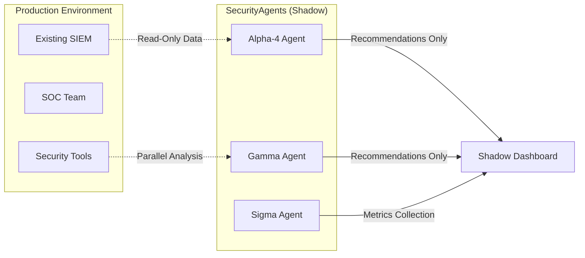
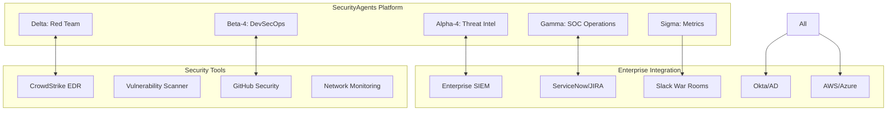

# Enterprise Deployment Strategy - SecurityAgents Platform

**Strategic approach for deploying SecurityAgents to scaled software companies without overwhelming people and systems**

---

## 🎯 Executive Summary

Deploying AI-powered security automation to enterprise environments requires careful orchestration to avoid disruption while demonstrating clear value. This strategy outlines a **phased cold-start approach** that minimizes risk while maximizing adoption and ROI.

**Key Principle**: **Prove value in isolation before integration**

---

## 🚧 Deployment Challenges Analysis

### **🔧 Technical Integration Complexity**

| Challenge | Impact | Mitigation Strategy |
|-----------|---------|-------------------|
| **Existing SIEM Conflicts** | Medium-High | Deploy in shadow mode, parallel data collection |
| **API Rate Limiting** | Medium | Implement intelligent queuing, prioritization |
| **Network Segmentation** | High | DMZ deployment, controlled API access |
| **Legacy Infrastructure** | High | Container abstraction, minimal dependency requirements |
| **Identity System Integration** | Medium | Start with read-only, gradually increase permissions |

### **👥 Organizational Resistance**

| Challenge | Impact | Mitigation Strategy |
|-----------|---------|-------------------|
| **Workflow Disruption** | High | Parallel operation, gradual workflow integration |
| **AI Trust Concerns** | High | Transparent decision-making, human oversight |
| **Job Security Fears** | Medium | Position as augmentation, not replacement |
| **Change Fatigue** | Medium | Phased rollout, clear communication |
| **Budget Approval** | Medium | Pilot program with measured ROI |

### **🛡️ Security & Compliance Concerns**

| Challenge | Impact | Mitigation Strategy |
|-----------|---------|-------------------|
| **AI Decision Accountability** | High | Audit trails, human approval workflows |
| **Data Privacy** | High | Local deployment, data minimization |
| **Compliance Requirements** | Medium | Compliance-first design, audit support |
| **Third-Party Risk** | Medium | Vendor risk assessment, SLA requirements |
| **Incident Response Changes** | High | Parallel processes, gradual transition |

### **💰 Resource & Performance Concerns**

| Challenge | Impact | Mitigation Strategy |
|-----------|---------|-------------------|
| **Infrastructure Scaling** | Medium | Cloud-native, auto-scaling architecture |
| **Training Overhead** | High | Gradual rollout, champion program |
| **Maintenance Complexity** | Medium | Automated ops, clear runbooks |
| **Performance at Scale** | High | Load testing, performance monitoring |
| **Cost Management** | Medium | Usage-based scaling, cost monitoring |

---

## 🚀 Cold Start Deployment Plan

### **Phase 0: Foundation (Weeks 1-2)**
**Goal**: Establish technical foundation without touching production systems

#### **Infrastructure Setup**
```bash
# Isolated Environment Deployment
# - Dedicated VPC/network segment
# - Container orchestration (K8s/Docker Swarm)
# - Monitoring and logging infrastructure
# - Backup and recovery systems
```

#### **Key Activities**
- [ ] **Technical Architecture Review** - Validate compatibility with existing systems
- [ ] **Security Assessment** - Complete security review and pen testing
- [ ] **Compliance Validation** - Ensure audit requirements are met
- [ ] **Performance Baseline** - Establish performance metrics and SLAs

#### **Success Criteria**
- ✅ Platform deployed in isolated environment
- ✅ Security and compliance validation complete
- ✅ Performance benchmarks established
- ✅ Executive and security team buy-in secured

---

### **Phase 1: Shadow Mode Validation (Weeks 3-6)**
**Goal**: Validate agent capabilities without impacting existing operations

#### **Shadow Deployment Strategy**


#### **Implementation Approach**

**Week 3-4: Read-Only Data Collection**
- Deploy agents in **observer mode only**
- Collect same data as existing tools
- Generate parallel analysis and recommendations
- **No automated actions** - recommendations only

**Week 5-6: Validation & Comparison**
- Compare agent recommendations vs. human decisions
- Measure accuracy, false positive/negative rates
- Collect user feedback on recommendation quality
- Document value-add cases where agents identified missed threats

#### **Key Metrics to Track**
| Metric | Target | Current Baseline |
|---------|--------|------------------|
| **Threat Detection Accuracy** | >95% | Measure against existing tools |
| **False Positive Rate** | <5% | Compare to current FP rates |
| **Time to Detection** | 50% improvement | Baseline current MTTR |
| **Alert Triage Efficiency** | 60% reduction | Current manual triage time |
| **User Satisfaction** | >8/10 | Survey SOC analysts |

#### **Success Criteria**
- ✅ Agent recommendations achieve >90% accuracy vs. human decisions
- ✅ SOC team reports positive value from recommendations
- ✅ Zero disruption to existing operations
- ✅ Clear ROI demonstration ($100K+ value identified)

---

### **Phase 2: Limited Automation (Weeks 7-10)**
**Goal**: Enable low-risk automated actions with human oversight

#### **Graduated Automation Strategy**

**Week 7-8: Low-Risk Actions**
- **Automated IOC enrichment** - Safe data gathering
- **Alert correlation** - Grouping related alerts
- **Report generation** - Automated executive summaries
- **Threat intelligence updates** - Feed updates to existing tools

**Week 9-10: Medium-Risk Actions with Approval**
- **Network blocking** - Requires human approval
- **User account restrictions** - With manager notification
- **Automated investigation** - Data collection only
- **Incident documentation** - Auto-populate ticket fields

#### **Approval Workflow**
```python
# Example: Automated Action with Human Oversight
class AutomatedAction:
    def execute_with_oversight(self, action, confidence):
        if confidence > 0.95 and action.risk_level == "LOW":
            return self.execute_immediately(action)
        elif confidence > 0.85:
            return self.request_approval(action, timeout=30)
        else:
            return self.log_recommendation_only(action)
```

#### **Risk Controls**
- **Action Categories**: LOW/MEDIUM/HIGH risk classification
- **Confidence Thresholds**: Different automation levels by confidence
- **Human Approval**: Required for medium/high-risk actions
- **Rollback Capability**: All actions must be reversible
- **Audit Logging**: Complete action trail for compliance

#### **Success Criteria**
- ✅ Low-risk automation saves >20 hours/week
- ✅ Zero security incidents from automated actions
- ✅ Human approval workflow operates smoothly
- ✅ SOC team comfort level with automation increases

---

### **Phase 3: Full Integration (Weeks 11-16)**
**Goal**: Complete integration with existing security operations

#### **Integration Strategy**

**Week 11-12: Workflow Integration**
- **SIEM Integration**: Direct alert creation and updates
- **Ticketing Integration**: Auto-populate and update tickets
- **Communication Integration**: Slack/Teams notifications
- **Runbook Integration**: Automated playbook execution

**Week 13-14: Advanced Automation**
- **High-confidence actions**: Automated blocking/quarantine
- **Threat hunting**: Autonomous threat detection
- **Incident response**: Automated containment and investigation
- **Compliance reporting**: Automated audit artifact generation

**Week 15-16: Optimization & Scaling**
- **Performance tuning**: Optimize for scale
- **Agent coordination**: Multi-agent workflows
- **Custom integration**: Company-specific tool integration
- **Training program**: Comprehensive team training

#### **Full Deployment Architecture**


#### **Success Criteria**
- ✅ 90% of routine security tasks automated
- ✅ 50% reduction in MTTR for security incidents
- ✅ SOC team focuses on high-value analysis and strategy
- ✅ Demonstrated ROI of >300% within first year

---

## 📊 Success Metrics & KPIs

### **Technical Performance**
- **Availability**: >99.9% uptime
- **Response Time**: <2 seconds for standard queries
- **Throughput**: Handle 10K+ events/second
- **Accuracy**: >95% threat detection accuracy

### **Business Impact**
- **Cost Reduction**: $950K+ annual savings demonstrated
- **Efficiency Gains**: 60% reduction in manual security tasks
- **Risk Reduction**: 50% improvement in threat detection/response times
- **User Satisfaction**: >8/10 rating from security team

### **Organizational Adoption**
- **User Adoption**: >90% of SOC team actively using platform
- **Process Integration**: SecurityAgents integrated into all major workflows
- **Training Completion**: 100% of team trained on new processes
- **Change Management**: Smooth transition with minimal resistance

---

## ⚠️ Risk Mitigation Strategy

### **Technical Risks**

| Risk | Probability | Impact | Mitigation |
|------|-------------|---------|------------|
| **Platform Performance Issues** | Medium | High | Load testing, performance monitoring, auto-scaling |
| **Integration Failures** | Medium | Medium | Parallel systems, fallback procedures, rollback plans |
| **Security Vulnerabilities** | Low | High | Security reviews, pen testing, continuous monitoring |
| **Data Loss/Corruption** | Low | High | Backup systems, data validation, recovery procedures |

### **Organizational Risks**

| Risk | Probability | Impact | Mitigation |
|------|-------------|---------|------------|
| **User Resistance** | High | Medium | Change management, training, champion program |
| **Executive Support Loss** | Low | High | Regular ROI reporting, success story communication |
| **Budget Constraints** | Medium | Medium | Phased approach, demonstrated value, cost optimization |
| **Compliance Issues** | Medium | High | Compliance-first design, audit support, documentation |

### **Operational Risks**

| Risk | Probability | Impact | Mitigation |
|------|-------------|---------|------------|
| **False Positive Overload** | High | Medium | Tuning, confidence thresholds, human oversight |
| **Missed Critical Threats** | Medium | High | Parallel monitoring, escalation procedures, validation |
| **Workflow Disruption** | Medium | Medium | Gradual integration, parallel processes, training |
| **Vendor Dependency** | Low | Medium | Multi-vendor strategy, exit planning, local deployment |

---

## 🎯 Cold Start Checklist

### **Pre-Deployment (Weeks 1-2)**
- [ ] Executive sponsorship secured
- [ ] Security team champion identified
- [ ] Technical architecture validated
- [ ] Compliance requirements documented
- [ ] Budget and resources approved
- [ ] Change management plan developed

### **Shadow Mode (Weeks 3-6)**
- [ ] Isolated deployment complete
- [ ] Read-only data collection functioning
- [ ] Baseline metrics established
- [ ] Accuracy validation complete
- [ ] User feedback collected
- [ ] ROI demonstration prepared

### **Limited Automation (Weeks 7-10)**
- [ ] Low-risk automation deployed
- [ ] Human oversight workflows functioning
- [ ] Approval processes working smoothly
- [ ] Risk controls validated
- [ ] User comfort level assessed
- [ ] Automation value demonstrated

### **Full Integration (Weeks 11-16)**
- [ ] Complete SIEM integration
- [ ] All workflows integrated
- [ ] Advanced automation enabled
- [ ] Team training complete
- [ ] Performance optimized
- [ ] Success metrics achieved

---

## 💡 Key Success Factors

### **Technical Excellence**
- **Start Simple**: Begin with read-only, low-risk capabilities
- **Prove Value**: Demonstrate clear ROI before expanding scope
- **Maintain Standards**: Never compromise on security or compliance
- **Scale Gradually**: Increase automation as confidence builds

### **Change Management**
- **Communicate Clearly**: Transparent about capabilities and limitations
- **Involve Users**: SOC team input throughout deployment
- **Celebrate Wins**: Highlight successes and value delivered
- **Learn Continuously**: Iterate based on feedback and results

### **Risk Management**
- **Conservative Approach**: Better to move slowly than break things
- **Parallel Systems**: Always maintain fallback capabilities
- **Human Oversight**: People remain in control of critical decisions
- **Continuous Monitoring**: Watch for issues and address quickly

---

**This strategy transforms a complex security platform deployment into a managed, low-risk journey that builds confidence and demonstrates value at every step.**