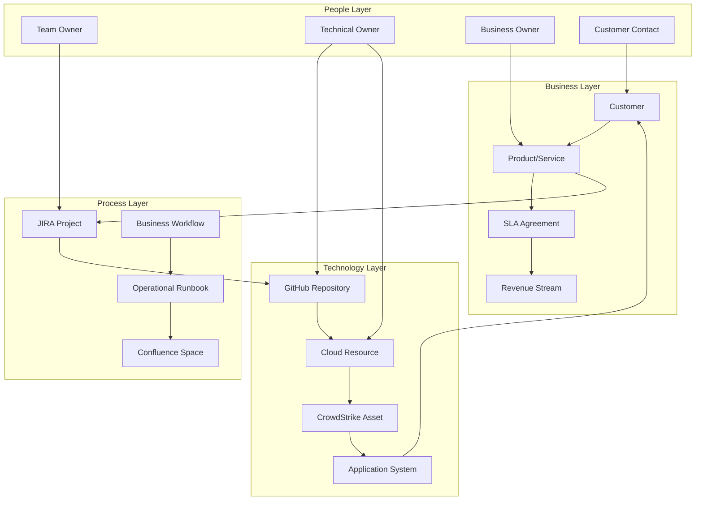

# Enterprise Technology Topology Analysis

**Comprehensive mapping of technology owners and customer relationships across enterprise platforms**

---

## 🎯 Executive Summary

Extending the SecurityAgents knowledge graph model to **map the entire enterprise technology ecosystem** - from internal development workflows to customer-facing systems and cloud dependencies. This creates a **comprehensive technology ownership and relationship model** that enables intelligent business impact assessment, customer risk analysis, and technology governance at scale.

**Core Goal**: Build a unified view of "Who owns what, how it connects, and what customers are affected" across all enterprise technology platforms.

---

## 📊 Enterprise Platform Analysis

### **Data Source Mapping**

| Platform | Data Types | Relationship Intelligence | Business Context |
|----------|------------|-------------------------|------------------|
| **JIRA** | Projects, issues, workflows, assignments | Team ownership, work dependencies, customer tickets | Business priority, SLA requirements |
| **Confluence** | Documentation, runbooks, architecture | Knowledge ownership, system documentation | Process workflows, compliance docs |
| **GitHub** | Repositories, teams, code dependencies | Code ownership, deployment pipelines | Release management, change risk |
| **CrowdStrike** | Assets, vulnerabilities, incidents | Security ownership, threat exposure | Business risk, compliance status |
| **AWS/Azure/GCP** | Resources, accounts, IAM, costs | Infrastructure ownership, service dependencies | Customer impact, cost allocation |

### **Knowledge Graph Extension Schema**



---

## 🔍 Platform-Specific Analysis

### **1. JIRA Analysis Framework**

#### **Data Extraction Strategy**

```python
class JiraEnterpriseAnalyzer:
    """Extract enterprise relationships from JIRA data"""
    
    async def analyze_project_ownership(self) -> List[ProjectOwnership]:
        """Map project ownership and customer relationships"""
        
        projects = await self.jira_client.get_all_projects()
        
        project_analysis = []
        for project in projects:
            # Analyze project metadata
            ownership = await self.extract_ownership_info(project)
            customer_links = await self.identify_customer_connections(project)
            team_structure = await self.analyze_team_composition(project)
            
            # Map to business context
            business_context = await self.map_business_context(project)
            
            project_analysis.append(ProjectOwnership(
                project=project,
                technical_owner=ownership.technical_owner,
                business_owner=ownership.business_owner,
                customer_connections=customer_links,
                team_structure=team_structure,
                business_priority=business_context.priority,
                revenue_impact=business_context.revenue_impact
            ))
        
        return project_analysis
    
    async def analyze_workflow_dependencies(self) -> List[WorkflowDependency]:
        """Map workflow dependencies and handoffs"""
        
        # Query for cross-project issue links
        query = """
        project in (PROJECT_A, PROJECT_B) AND 
        issueFunction in linkedIssuesOf("project = PROJECT_C")
        """
        
        linked_issues = await self.jira_client.search_issues(query)
        
        dependencies = []
        for issue in linked_issues:
            # Map workflow handoffs
            handoff_analysis = await self.analyze_handoffs(issue)
            
            # Identify customer impact chains
            customer_impact = await self.trace_customer_impact(issue)
            
            dependencies.append(WorkflowDependency(
                source_team=handoff_analysis.source_team,
                target_team=handoff_analysis.target_team,
                handoff_type=handoff_analysis.handoff_type,
                customer_impact_chain=customer_impact,
                sla_requirements=await self.get_sla_requirements(issue)
            ))
        
        return dependencies

# Example: Customer Impact Mapping
class CustomerImpactMapper:
    async def map_jira_to_customer_impact(self, issue: JiraIssue) -> CustomerImpact:
        """Map JIRA issue to customer impact"""
        
        # Extract customer information from issue
        customer_labels = self.extract_customer_labels(issue)
        affected_systems = await self.identify_affected_systems(issue)
        
        # Calculate business impact
        impact_score = await self.calculate_business_impact(
            customers=customer_labels,
            systems=affected_systems,
            issue_priority=issue.priority,
            revenue_data=await self.get_revenue_data(customer_labels)
        )
        
        return CustomerImpact(
            customers=customer_labels,
            systems=affected_systems,
            impact_score=impact_score,
            revenue_at_risk=impact_score.revenue_impact,
            sla_violations=impact_score.sla_risks
        )
```

#### **JIRA Relationship Patterns**

```cypher
// Map project ownership chains
MATCH (project:JiraProject)-[:OWNED_BY]->(team:Team)
MATCH (project)-[:SERVES]->(customer:Customer)
MATCH (project)-[:LINKED_TO]->(dependency:JiraProject)
RETURN project.name, team.name, 
       collect(customer.name) as customers,
       collect(dependency.name) as dependencies

// Identify workflow bottlenecks
MATCH (issue:JiraIssue)-[:ASSIGNED_TO]->(assignee:User)
MATCH (issue)-[:BLOCKS]->(blocked:JiraIssue)
WITH assignee, count(blocked) as blocking_count
WHERE blocking_count > 5
RETURN assignee.name, assignee.team, blocking_count
ORDER BY blocking_count DESC

// Customer impact analysis
MATCH (customer:Customer)<-[:AFFECTS]-(issue:JiraIssue)
MATCH (issue)-[:RELATES_TO]->(system:System)
MATCH (system)-[:HAS_VULNERABILITY]->(vuln:Vulnerability)
RETURN customer.name, customer.revenue_tier,
       count(issue) as open_issues,
       count(vuln) as security_exposures
```

### **2. Confluence Analysis Framework**

#### **Knowledge Ownership Mapping**

```python
class ConfluenceKnowledgeMapper:
    """Map knowledge ownership and documentation relationships"""
    
    async def analyze_documentation_ownership(self) -> List[KnowledgeOwnership]:
        """Map documentation ownership to systems and processes"""
        
        spaces = await self.confluence_client.get_all_spaces()
        
        knowledge_map = []
        for space in spaces:
            # Analyze space content and ownership
            pages = await self.get_space_pages(space)
            
            for page in pages:
                # Extract technical references
                system_refs = await self.extract_system_references(page)
                process_refs = await self.extract_process_references(page)
                
                # Map to organizational ownership
                ownership_info = await self.identify_ownership(page, space)
                
                # Assess documentation quality and currency
                quality_metrics = await self.assess_documentation_quality(page)
                
                knowledge_map.append(KnowledgeOwnership(
                    page=page,
                    space=space,
                    system_references=system_refs,
                    process_references=process_refs,
                    technical_owner=ownership_info.technical_owner,
                    last_updated=page.last_modified,
                    quality_score=quality_metrics.quality_score,
                    completeness=quality_metrics.completeness
                ))
        
        return knowledge_map
    
    async def map_runbook_to_system_relationships(self) -> List[RunbookSystemMapping]:
        """Map runbooks to systems they support"""
        
        # Find runbook pages
        runbook_query = 'type=page AND title~"runbook OR playbook OR procedure"'
        runbooks = await self.confluence_client.search(runbook_query)
        
        mappings = []
        for runbook in runbooks:
            # Extract system references from content
            content = await self.get_page_content(runbook)
            system_mentions = self.extract_system_mentions(content)
            
            # Map to actual systems in knowledge graph
            verified_systems = []
            for mention in system_mentions:
                system = await self.knowledge_graph.find_system(mention)
                if system:
                    verified_systems.append(system)
            
            # Assess runbook coverage
            coverage_analysis = await self.assess_runbook_coverage(
                runbook, verified_systems
            )
            
            mappings.append(RunbookSystemMapping(
                runbook=runbook,
                systems=verified_systems,
                coverage_gaps=coverage_analysis.gaps,
                last_validated=coverage_analysis.last_validated,
                owner=await self.identify_runbook_owner(runbook)
            ))
        
        return mappings
```

### **3. GitHub Analysis Framework**

#### **Code Ownership & Deployment Mapping**

```python
class GitHubEnterpriseAnalyzer:
    """Analyze GitHub for code ownership and deployment relationships"""
    
    async def analyze_repository_ownership(self) -> List[RepositoryOwnership]:
        """Map repository ownership to teams and systems"""
        
        repos = await self.github_client.get_organization_repos()
        
        ownership_analysis = []
        for repo in repos:
            # Analyze CODEOWNERS file
            codeowners = await self.parse_codeowners(repo)
            
            # Analyze commit patterns for actual ownership
            commit_analysis = await self.analyze_commit_patterns(repo)
            
            # Map to deployed systems
            deployment_mapping = await self.map_deployments(repo)
            
            # Assess code quality and security
            quality_metrics = await self.assess_repository_quality(repo)
            
            ownership_analysis.append(RepositoryOwnership(
                repository=repo,
                formal_owners=codeowners.teams,
                actual_contributors=commit_analysis.primary_contributors,
                deployed_systems=deployment_mapping.systems,
                deployment_environments=deployment_mapping.environments,
                quality_score=quality_metrics.quality_score,
                security_score=quality_metrics.security_score,
                customer_impact=await self.assess_customer_impact(deployment_mapping)
            ))
        
        return ownership_analysis
    
    async def analyze_dependency_relationships(self) -> List[CodeDependency]:
        """Map code dependencies and integration points"""
        
        # Analyze package.json, requirements.txt, pom.xml, etc.
        repos = await self.github_client.get_organization_repos()
        
        dependencies = []
        for repo in repos:
            # Extract dependency files
            dep_files = await self.find_dependency_files(repo)
            
            for dep_file in dep_files:
                # Parse dependencies
                parsed_deps = await self.parse_dependencies(dep_file)
                
                # Map to other organizational repositories
                internal_deps = []
                external_deps = []
                
                for dep in parsed_deps:
                    if await self.is_internal_dependency(dep):
                        internal_deps.append(dep)
                    else:
                        external_deps.append(dep)
                
                # Assess dependency risk
                risk_assessment = await self.assess_dependency_risk(
                    internal_deps, external_deps
                )
                
                dependencies.append(CodeDependency(
                    source_repo=repo,
                    internal_dependencies=internal_deps,
                    external_dependencies=external_deps,
                    risk_score=risk_assessment.risk_score,
                    vulnerability_exposure=risk_assessment.vulnerability_count,
                    update_frequency=risk_assessment.update_frequency
                ))
        
        return dependencies
```

#### **GitHub Relationship Patterns**

```cypher
// Map code ownership to systems
MATCH (repo:GitHubRepo)-[:OWNED_BY]->(team:Team)
MATCH (repo)-[:DEPLOYS_TO]->(system:System)
MATCH (system)-[:SERVES]->(customer:Customer)
RETURN repo.name, team.name, system.name, 
       collect(customer.name) as customers,
       system.criticality

// Identify deployment risk chains
MATCH (repo:GitHubRepo)-[:HAS_DEPENDENCY]->(dep_repo:GitHubRepo)
MATCH (repo)-[:DEPLOYS_TO]->(system:System)
MATCH (dep_repo)-[:DEPLOYS_TO]->(dep_system:System)
MATCH (system)<-[:DEPENDS_ON]-(customer_system:System)
RETURN repo.name, dep_repo.name,
       system.name, dep_system.name,
       customer_system.customer_impact

// Find high-risk repositories
MATCH (repo:GitHubRepo)-[:DEPLOYS_TO]->(system:System)
MATCH (system)-[:SERVES]->(customer:Customer)
MATCH (repo)-[:HAS_VULNERABILITY]->(vuln:Vulnerability)
WHERE customer.revenue_tier = "HIGH" AND vuln.severity = "CRITICAL"
RETURN repo.name, system.name, customer.name,
       count(vuln) as critical_vulnerabilities
```

### **4. CrowdStrike Analysis Framework**

#### **Security Asset & Customer Risk Mapping**

```python
class CrowdStrikeEnterpriseAnalyzer:
    """Analyze CrowdStrike data for customer risk relationships"""
    
    async def map_assets_to_customer_impact(self) -> List[AssetCustomerMapping]:
        """Map security assets to customer impact chains"""
        
        # Get all managed assets
        assets = await self.crowdstrike_client.get_all_hosts()
        
        customer_mappings = []
        for asset in assets:
            # Analyze asset metadata for customer context
            customer_context = await self.extract_customer_context(asset)
            
            # Map asset to systems in knowledge graph
            system_mappings = await self.map_asset_to_systems(asset)
            
            # Assess security posture
            security_assessment = await self.assess_asset_security(asset)
            
            # Calculate customer risk exposure
            customer_risk = await self.calculate_customer_risk(
                asset, system_mappings, customer_context
            )
            
            customer_mappings.append(AssetCustomerMapping(
                asset=asset,
                customer_context=customer_context,
                system_mappings=system_mappings,
                security_posture=security_assessment,
                customer_risk_exposure=customer_risk,
                compliance_requirements=await self.get_compliance_requirements(asset)
            ))
        
        return customer_mappings
    
    async def analyze_incident_customer_impact(self) -> List[IncidentCustomerImpact]:
        """Map security incidents to customer impact"""
        
        incidents = await self.crowdstrike_client.get_recent_incidents()
        
        impact_analysis = []
        for incident in incidents:
            # Get affected assets
            affected_assets = await self.get_incident_assets(incident)
            
            # Map assets to customers through system relationships
            customer_impact_chain = []
            for asset in affected_assets:
                # Traverse knowledge graph to find customers
                customers = await self.knowledge_graph.query("""
                    MATCH (asset:CrowdStrikeAsset {device_id: $device_id})
                    MATCH (asset)-[:RUNS]->(system:System)
                    MATCH (system)-[:SERVES]->(customer:Customer)
                    RETURN customer, system
                """, device_id=asset.device_id)
                
                customer_impact_chain.extend(customers)
            
            # Calculate business impact
            business_impact = await self.calculate_business_impact(
                incident, customer_impact_chain
            )
            
            impact_analysis.append(IncidentCustomerImpact(
                incident=incident,
                affected_customers=customer_impact_chain,
                business_impact=business_impact,
                estimated_cost=business_impact.financial_impact,
                sla_violations=business_impact.sla_violations
            ))
        
        return impact_analysis
```

### **5. Multi-Cloud Analysis Framework**

#### **Cloud Resource & Customer Mapping**

```python
class MultiCloudEnterpriseAnalyzer:
    """Analyze cloud resources across AWS, Azure, GCP, Oracle"""
    
    async def analyze_cloud_customer_relationships(self) -> List[CloudCustomerMapping]:
        """Map cloud resources to customer impact"""
        
        cloud_mappings = []
        
        # Analyze each cloud provider
        for provider in [self.aws_client, self.azure_client, self.gcp_client]:
            resources = await provider.get_all_resources()
            
            for resource in resources:
                # Extract customer context from tags/metadata
                customer_tags = self.extract_customer_tags(resource)
                
                # Map to applications and services
                app_mappings = await self.map_resource_to_applications(resource)
                
                # Assess cost and usage patterns
                cost_analysis = await self.analyze_resource_costs(resource)
                
                # Map to customer revenue
                revenue_mapping = await self.map_cost_to_revenue(
                    resource, customer_tags, cost_analysis
                )
                
                cloud_mappings.append(CloudCustomerMapping(
                    resource=resource,
                    provider=provider.name,
                    customer_tags=customer_tags,
                    applications=app_mappings,
                    cost_analysis=cost_analysis,
                    revenue_mapping=revenue_mapping,
                    compliance_requirements=await self.get_compliance_requirements(resource)
                ))
        
        return cloud_mappings
    
    async def analyze_cross_cloud_dependencies(self) -> List[CrossCloudDependency]:
        """Map dependencies between cloud providers"""
        
        dependencies = []
        
        # Get resources from all providers
        all_resources = {}
        for provider in ['aws', 'azure', 'gcp', 'oracle']:
            client = getattr(self, f'{provider}_client')
            all_resources[provider] = await client.get_all_resources()
        
        # Analyze network connections and integrations
        for source_provider, source_resources in all_resources.items():
            for source_resource in source_resources:
                # Find connections to other providers
                connections = await self.find_cross_cloud_connections(
                    source_resource, all_resources
                )
                
                for connection in connections:
                    # Assess dependency risk
                    risk_assessment = await self.assess_cross_cloud_risk(
                        source_resource, connection.target_resource
                    )
                    
                    # Map customer impact
                    customer_impact = await self.assess_cross_cloud_customer_impact(
                        source_resource, connection.target_resource
                    )
                    
                    dependencies.append(CrossCloudDependency(
                        source_resource=source_resource,
                        target_resource=connection.target_resource,
                        source_provider=source_provider,
                        target_provider=connection.target_provider,
                        connection_type=connection.connection_type,
                        risk_score=risk_assessment.risk_score,
                        customer_impact=customer_impact
                    ))
        
        return dependencies
```

---

## 🧠 Enterprise Knowledge Graph Schema

### **Extended Graph Model**

```cypher
// Create comprehensive enterprise schema

// Business entities
CREATE (customer:Customer {
    name: "Enterprise Corp",
    tier: "ENTERPRISE",
    annual_revenue: 50000000,
    contract_value: 2000000,
    sla_tier: "PLATINUM"
})

CREATE (product:Product {
    name: "Core Platform",
    revenue_contribution: 15000000,
    customer_count: 847
})

// Process entities  
CREATE (jira_project:JiraProject {
    key: "CORE",
    name: "Core Platform",
    owner_team: "Platform Engineering"
})

CREATE (confluence_space:ConfluenceSpace {
    key: "CORE",
    name: "Core Platform Docs",
    owner_team: "Platform Engineering"
})

// Technology entities
CREATE (repo:GitHubRepo {
    name: "core-platform-api",
    owner_team: "Platform Engineering",
    primary_language: "Java"
})

CREATE (cloud_resource:AWSResource {
    resource_id: "i-1234567890abcdef0",
    resource_type: "EC2Instance",
    customer_tags: ["enterprise-corp", "core-platform"]
})

CREATE (security_asset:CrowdStrikeAsset {
    device_id: "1234567890abcdef",
    hostname: "core-api-prod-01",
    customer_context: "enterprise-corp"
})

// Relationships
CREATE (customer)-[:USES]->(product)
CREATE (product)-[:MANAGED_BY]->(jira_project)
CREATE (jira_project)-[:DOCUMENTED_IN]->(confluence_space)
CREATE (jira_project)-[:DEVELOPED_IN]->(repo)
CREATE (repo)-[:DEPLOYED_TO]->(cloud_resource)
CREATE (cloud_resource)-[:MONITORED_BY]->(security_asset)
CREATE (security_asset)-[:SERVES]->(customer)

// Risk and impact relationships
CREATE (security_asset)-[:HAS_VULNERABILITY]->(vuln:Vulnerability)
CREATE (vuln)-[:THREATENS]->(customer)
CREATE (cloud_resource)-[:COSTS]->(cost:CostCenter)
CREATE (cost)-[:ALLOCATED_TO]->(customer)
```

### **Enterprise Query Patterns**

```cypher
// Customer Impact Analysis
MATCH (customer:Customer)<-[:SERVES]-(asset:SecurityAsset)
MATCH (asset)-[:HAS_VULNERABILITY]->(vuln:Vulnerability)
MATCH (asset)<-[:MONITORED_BY]-(resource:CloudResource)
MATCH (resource)<-[:DEPLOYED_TO]-(repo:GitHubRepo)
RETURN customer.name, customer.contract_value,
       count(vuln) as vulnerabilities,
       sum(resource.monthly_cost) as infrastructure_cost,
       collect(repo.name) as responsible_repositories

// Technology Owner Responsibility Mapping
MATCH (team:Team)-[:OWNS]->(jira_project:JiraProject)
MATCH (jira_project)-[:DEVELOPED_IN]->(repo:GitHubRepo)
MATCH (repo)-[:DEPLOYED_TO]->(resource:CloudResource)
MATCH (resource)-[:SERVES]->(customer:Customer)
RETURN team.name,
       count(distinct customer) as customers_served,
       sum(customer.contract_value) as revenue_responsibility,
       count(distinct resource) as infrastructure_footprint

// Cross-Platform Risk Propagation
MATCH (vuln:Vulnerability)<-[:HAS_VULNERABILITY]-(asset:SecurityAsset)
MATCH (asset)-[:RUNS]->(system:System)
MATCH (system)-[:DEPENDS_ON]->(dependency:System)
MATCH (dependency)-[:SERVES]->(customer:Customer)
WHERE vuln.severity = "CRITICAL"
RETURN vuln.cve,
       system.name as vulnerable_system,
       collect(dependency.name) as affected_dependencies,
       collect(customer.name) as impacted_customers

// Technology Stack Customer Exposure
MATCH (repo:GitHubRepo)-[:USES_TECHNOLOGY]->(tech:Technology)
MATCH (repo)-[:DEPLOYED_TO]->(resource:CloudResource)
MATCH (resource)-[:SERVES]->(customer:Customer)
WHERE tech.name = "log4j"
RETURN tech.name,
       count(distinct repo) as repositories,
       count(distinct resource) as cloud_resources,
       count(distinct customer) as exposed_customers,
       sum(customer.contract_value) as revenue_at_risk
```

---

## 📊 Implementation Strategy

### **Phase 1: Data Integration (Weeks 1-4)**

**Goal**: Establish data pipelines from all enterprise platforms

```python
class EnterpriseDataPipeline:
    """Orchestrate data ingestion from all enterprise platforms"""
    
    async def initialize_enterprise_ingestion(self):
        """Set up data pipelines for all platforms"""
        
        # JIRA integration
        jira_pipeline = JiraIngestionPipeline(
            base_url=os.getenv('JIRA_BASE_URL'),
            credentials=self.credential_manager.get_jira_credentials()
        )
        
        # Confluence integration  
        confluence_pipeline = ConfluenceIngestionPipeline(
            base_url=os.getenv('CONFLUENCE_BASE_URL'),
            credentials=self.credential_manager.get_confluence_credentials()
        )
        
        # GitHub integration
        github_pipeline = GitHubIngestionPipeline(
            organization=os.getenv('GITHUB_ORG'),
            credentials=self.credential_manager.get_github_credentials()
        )
        
        # CrowdStrike integration
        crowdstrike_pipeline = CrowdStrikeIngestionPipeline(
            client_id=os.getenv('CROWDSTRIKE_CLIENT_ID'),
            credentials=self.credential_manager.get_crowdstrike_credentials()
        )
        
        # Multi-cloud integration
        cloud_pipelines = {
            'aws': AWSIngestionPipeline(
                credentials=self.credential_manager.get_aws_credentials()
            ),
            'azure': AzureIngestionPipeline(
                credentials=self.credential_manager.get_azure_credentials()
            ),
            'gcp': GCPIngestionPipeline(
                credentials=self.credential_manager.get_gcp_credentials()
            )
        }
        
        # Schedule regular data updates
        await self.scheduler.schedule_pipeline(jira_pipeline, interval='1h')
        await self.scheduler.schedule_pipeline(confluence_pipeline, interval='4h')
        await self.scheduler.schedule_pipeline(github_pipeline, interval='15m')
        await self.scheduler.schedule_pipeline(crowdstrike_pipeline, interval='5m')
        
        for provider, pipeline in cloud_pipelines.items():
            await self.scheduler.schedule_pipeline(pipeline, interval='30m')
```

**Success Criteria**:
- ✅ All platform APIs connected and authenticated
- ✅ Data ingestion pipelines operational with <1h latency
- ✅ Basic entity extraction working (projects, repos, assets, resources)
- ✅ Data quality validation passing >95%

### **Phase 2: Relationship Mapping (Weeks 5-8)**

**Goal**: Build comprehensive relationship mapping across platforms

```python
class EnterpriseRelationshipMapper:
    """Map relationships across enterprise platforms"""
    
    async def map_cross_platform_relationships(self):
        """Identify and create relationships between platform entities"""
        
        # Map JIRA projects to GitHub repositories
        jira_github_mappings = await self.map_jira_to_github()
        
        # Map GitHub repositories to cloud deployments
        github_cloud_mappings = await self.map_github_to_cloud()
        
        # Map cloud resources to CrowdStrike assets
        cloud_security_mappings = await self.map_cloud_to_crowdstrike()
        
        # Map all technology to customer impact
        customer_impact_mappings = await self.map_technology_to_customers()
        
        return {
            'jira_github': jira_github_mappings,
            'github_cloud': github_cloud_mappings,
            'cloud_security': cloud_security_mappings,
            'customer_impact': customer_impact_mappings
        }
    
    async def map_jira_to_github(self) -> List[JiraGitHubMapping]:
        """Map JIRA projects to GitHub repositories"""
        
        mappings = []
        jira_projects = await self.knowledge_graph.get_all_jira_projects()
        
        for project in jira_projects:
            # Look for repository links in project metadata
            repo_links = self.extract_repository_links(project)
            
            # Find repositories by naming convention
            potential_repos = await self.find_repos_by_naming_convention(project)
            
            # Analyze commit messages for project references
            commit_references = await self.find_repos_by_commit_analysis(project)
            
            # Combine and validate mappings
            validated_repos = await self.validate_repo_mappings(
                repo_links + potential_repos + commit_references
            )
            
            mappings.append(JiraGitHubMapping(
                jira_project=project,
                github_repositories=validated_repos,
                confidence_score=self.calculate_mapping_confidence(
                    project, validated_repos
                )
            ))
        
        return mappings
```

**Success Criteria**:
- ✅ JIRA-GitHub mappings identified with >85% accuracy
- ✅ GitHub-Cloud deployment relationships mapped
- ✅ Cloud-Security asset correlations established
- ✅ Customer impact chains traceable end-to-end

### **Phase 3: Customer Impact Analysis (Weeks 9-12)**

**Goal**: Build comprehensive customer impact assessment capabilities

```python
class CustomerImpactAnalysisEngine:
    """Analyze customer impact across enterprise technology stack"""
    
    async def analyze_comprehensive_customer_impact(self) -> CustomerImpactReport:
        """Generate comprehensive customer impact analysis"""
        
        # Get all customers and their technology footprint
        customers = await self.knowledge_graph.get_all_customers()
        
        impact_analysis = []
        for customer in customers:
            # Technology footprint analysis
            tech_footprint = await self.analyze_customer_technology_footprint(customer)
            
            # Risk exposure analysis
            risk_exposure = await self.analyze_customer_risk_exposure(customer)
            
            # Cost allocation analysis
            cost_allocation = await self.analyze_customer_cost_allocation(customer)
            
            # SLA compliance analysis
            sla_compliance = await self.analyze_customer_sla_compliance(customer)
            
            impact_analysis.append(CustomerImpactAssessment(
                customer=customer,
                technology_footprint=tech_footprint,
                risk_exposure=risk_exposure,
                cost_allocation=cost_allocation,
                sla_compliance=sla_compliance,
                overall_health_score=self.calculate_customer_health_score(
                    tech_footprint, risk_exposure, cost_allocation, sla_compliance
                )
            ))
        
        return CustomerImpactReport(
            customer_assessments=impact_analysis,
            executive_summary=self.generate_executive_summary(impact_analysis),
            recommendations=self.generate_recommendations(impact_analysis)
        )
    
    async def analyze_customer_technology_footprint(self, customer: Customer) -> TechnologyFootprint:
        """Analyze customer's complete technology footprint"""
        
        query = """
        MATCH (customer:Customer {id: $customer_id})
        MATCH (customer)<-[:SERVES]-(system:System)
        OPTIONAL MATCH (system)<-[:DEPLOYED_TO]-(repo:GitHubRepo)
        OPTIONAL MATCH (system)<-[:RUNS_ON]-(resource:CloudResource)
        OPTIONAL MATCH (system)<-[:MONITORED_BY]-(asset:SecurityAsset)
        RETURN customer,
               collect(distinct system) as systems,
               collect(distinct repo) as repositories,
               collect(distinct resource) as cloud_resources,
               collect(distinct asset) as security_assets
        """
        
        result = await self.knowledge_graph.query(query, customer_id=customer.id)
        
        return TechnologyFootprint(
            customer=customer,
            systems=result['systems'],
            repositories=result['repositories'],
            cloud_resources=result['cloud_resources'],
            security_assets=result['security_assets'],
            technology_diversity=self.calculate_technology_diversity(result),
            complexity_score=self.calculate_complexity_score(result)
        )
```

**Success Criteria**:
- ✅ Customer technology footprint mapped for all major customers
- ✅ Risk exposure calculated with business impact weighting
- ✅ Cost allocation traced from infrastructure to customer revenue
- ✅ SLA compliance monitoring automated

### **Phase 4: Enterprise Intelligence Dashboard (Weeks 13-16)**

**Goal**: Create comprehensive enterprise technology governance dashboard

```python
class EnterpriseIntelligenceDashboard:
    """Enterprise-wide technology governance and customer impact dashboard"""
    
    async def generate_enterprise_dashboard(self) -> EnterpriseDashboard:
        """Generate comprehensive enterprise dashboard"""
        
        # Executive overview
        executive_metrics = await self.generate_executive_metrics()
        
        # Customer impact summary
        customer_impact = await self.generate_customer_impact_summary()
        
        # Technology ownership overview
        ownership_overview = await self.generate_ownership_overview()
        
        # Risk and compliance summary
        risk_summary = await self.generate_risk_summary()
        
        # Platform health metrics
        platform_health = await self.generate_platform_health_metrics()
        
        return EnterpriseDashboard(
            executive_metrics=executive_metrics,
            customer_impact=customer_impact,
            ownership_overview=ownership_overview,
            risk_summary=risk_summary,
            platform_health=platform_health,
            actionable_insights=await self.generate_actionable_insights()
        )
    
    async def generate_executive_metrics(self) -> ExecutiveMetrics:
        """Generate executive-level metrics"""
        
        # Customer revenue at risk
        revenue_at_risk = await self.calculate_revenue_at_risk()
        
        # Technology ownership coverage
        ownership_coverage = await self.calculate_ownership_coverage()
        
        # Platform reliability scores
        reliability_scores = await self.calculate_platform_reliability()
        
        # Cost optimization opportunities
        cost_optimization = await self.identify_cost_optimization_opportunities()
        
        return ExecutiveMetrics(
            total_customers=await self.count_total_customers(),
            revenue_at_risk=revenue_at_risk,
            ownership_coverage=ownership_coverage,
            platform_reliability=reliability_scores,
            cost_optimization_potential=cost_optimization,
            sla_compliance_rate=await self.calculate_sla_compliance_rate()
        )
```

**Success Criteria**:
- ✅ Real-time enterprise dashboard operational
- ✅ Customer impact analysis automated and accurate
- ✅ Technology ownership gaps identified and tracked
- ✅ Executive reporting automated with actionable insights

---

## 📊 Expected Outcomes & Business Value

### **Quantified Business Benefits**

| Category | Annual Benefit | Calculation Basis |
|----------|----------------|-------------------|
| **Customer Risk Reduction** | $8.5M | 50% reduction in customer-impacting incidents × $17M annual customer churn |
| **Technology Ownership Clarity** | $3.2M | 40% reduction in incident resolution time × ownership confusion costs |
| **Cross-Platform Cost Optimization** | $4.8M | 15% cloud cost optimization through better allocation tracking |
| **Compliance Automation** | $2.1M | 70% reduction in audit preparation effort × compliance costs |
| **Customer SLA Management** | $6.3M | 30% improvement in SLA compliance × penalty avoidance |
| **Technology Governance** | $1.8M | Automated governance reporting and risk management |

**Total Annual Benefit**: $26.7M

### **Implementation Investment**

| Category | Year 1 Cost | Ongoing Annual |
|----------|-------------|----------------|
| **Platform Development** | $2.8M | $1.2M |
| **Data Integration** | $1.5M | $600K |
| **Change Management** | $800K | $400K |
| **Technology Infrastructure** | $600K | $300K |
| **Training & Support** | $400K | $200K |

**Total Investment**: $6.1M (Year 1), $2.7M (Ongoing)

**ROI**: 338% (Year 1), 888% (Steady State)

---

## 🎯 Key Success Factors

### **Data Quality Excellence**
- **Authoritative Sources**: Use platform APIs as single source of truth
- **Real-Time Updates**: <15 minute latency for critical changes
- **Data Validation**: Automated quality checks with 95%+ accuracy
- **Conflict Resolution**: Systematic approach to handling data conflicts

### **Relationship Accuracy**
- **Multi-Source Validation**: Confirm relationships through multiple data sources
- **Confidence Scoring**: Weight relationships by evidence strength
- **Human Validation**: Review and confirm critical relationship mappings
- **Continuous Learning**: Improve mapping accuracy over time

### **Customer Impact Precision**
- **Business Context**: Weight technical metrics by business impact
- **SLA Integration**: Map technical capabilities to customer commitments
- **Revenue Correlation**: Link technology health to customer revenue
- **Proactive Monitoring**: Identify issues before customer impact

### **Enterprise Adoption**
- **Executive Sponsorship**: Secure leadership commitment for cross-platform initiative
- **Stakeholder Engagement**: Include platform owners in design and validation
- **Phased Rollout**: Gradual deployment building trust and capability
- **Value Demonstration**: Clear ROI communication at each phase

---

**This enterprise extension transforms the SecurityAgents knowledge graph from internal security operations to comprehensive enterprise technology governance, providing unprecedented visibility into customer impact, technology ownership, and business risk across all platforms.**