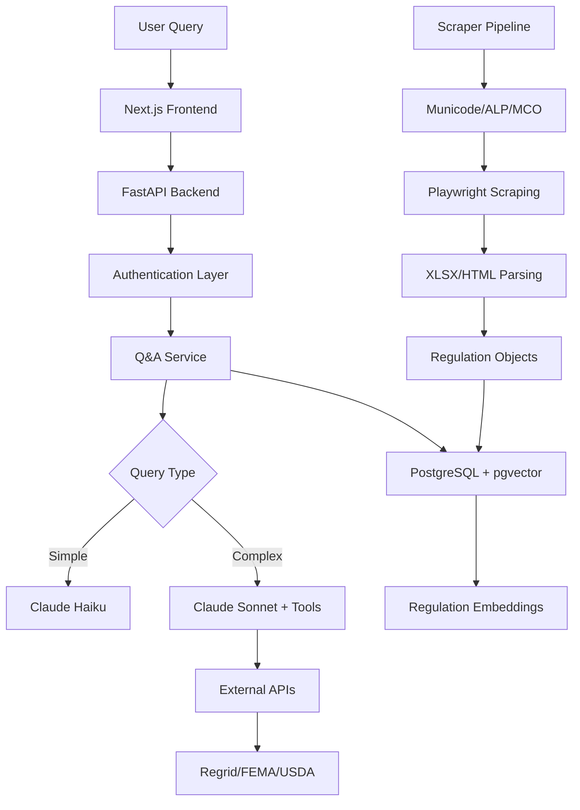

# GroundLayer Threat Model

**Document Version:** 1.0  
**Date:** March 6, 2026  
**Classification:** Confidential  
**Prepared for:** GroundLayer Development Team  
**Prepared by:** Enhanced Security Intelligence Platform

---

## Executive Summary

GroundLayer is an AI-powered regulatory intelligence platform serving civil engineers, architects, and real estate developers with critical "Can I build this here?" analysis across 200+ jurisdictions. This threat model identifies security risks across the platform's architecture, data handling, and AI-driven services, providing prioritized recommendations to protect both organizational assets and customer data.

**Key Findings:**
- **High Risk**: AI model manipulation, regulatory data integrity, and customer PII exposure
- **Medium Risk**: API abuse, scraper detection, and third-party dependency vulnerabilities  
- **Critical Dependencies**: Claude API, PostgreSQL/pgvector, and external regulatory data sources

**Recommended Actions:**
1. Implement AI model output validation and adversarial input detection
2. Establish comprehensive data integrity monitoring for regulatory content
3. Deploy advanced authentication and authorization controls for customer data
4. Create incident response procedures for regulatory data poisoning

---

## System Overview

### Platform Architecture

GroundLayer operates as an async-first microservices architecture with the following core components:

| Component | Technology | Security Criticality |
|-----------|------------|-------------------|
| **Frontend** | Next.js 14 (App Router), TypeScript | Medium |
| **API Gateway** | FastAPI (async) | High |
| **Database** | PostgreSQL 16 + pgvector | Critical |
| **AI Engine** | Anthropic Claude API (Haiku/Sonnet) | Critical |
| **Cache Layer** | Redis | Medium |
| **Scrapers** | Playwright, Python 3.12 | High |
| **External APIs** | Regrid, FEMA NFHL, USDA SSURGO | Medium |

### Data Flow Architecture



### Key Business Assets

| Asset Category | Examples | Confidentiality | Integrity | Availability |
|----------------|----------|-----------------|-----------|--------------|
| **Customer Data** | User accounts, query history, site analyses | **Critical** | High | High |
| **Regulatory Database** | 56K+ regulations, zoning codes, building standards | Medium | **Critical** | **Critical** |
| **AI Models/Prompts** | Claude prompts, extraction algorithms | **Critical** | **Critical** | High |
| **Business Intelligence** | Usage patterns, jurisdiction coverage gaps | High | Medium | Medium |
| **Infrastructure** | API keys, database credentials, OAuth tokens | **Critical** | **Critical** | **Critical** |

---

## Threat Modeling Methodology

### STRIDE Analysis Framework

This threat model employs the STRIDE methodology (Spoofing, Tampering, Repudiation, Information Disclosure, Denial of Service, Elevation of Privilege) across five key domains:

1. **User Authentication & Authorization**
2. **AI/ML Pipeline Security**
3. **Data Integrity & Regulatory Intelligence**
4. **API Security & External Integrations**
5. **Infrastructure & Operational Security**

### Risk Assessment Matrix

| Impact Level | Description | Examples |
|--------------|-------------|----------|
| **Critical** | Threatens core business, regulatory compliance, or customer safety | Regulatory data poisoning, customer PII breach |
| **High** | Significant business disruption or competitive advantage loss | AI model theft, service unavailability |
| **Medium** | Operational impact or customer trust degradation | Query history disclosure, scraper blocking |
| **Low** | Minor inconvenience with limited business impact | UI defacement, non-critical logs exposure |

### Likelihood Assessment

| Likelihood | Description | Threat Actor Types |
|------------|-------------|------------------|
| **Very High** | Daily attempts, automated attacks | Script kiddies, automated bots |
| **High** | Weekly attempts, opportunistic attackers | Cybercriminals, competitors |
| **Medium** | Monthly attempts, targeted campaigns | APT groups, industrial espionage |
| **Low** | Rare, highly sophisticated attacks | Nation-states, advanced threat actors |

---

## Threat Analysis by Domain

## Domain 1: User Authentication & Authorization

### T-AUTH-001: Identity Spoofing via OAuth Manipulation
- **STRIDE Category**: Spoofing
- **Attack Vector**: Manipulated OAuth callbacks, session hijacking
- **Likelihood**: High
- **Impact**: High
- **Description**: Attackers exploit OAuth flow vulnerabilities to impersonate legitimate users, accessing private site analyses and customer data.
- **Assets at Risk**: Customer accounts, query history, private site data
- **Mitigation**: Implement OAuth state validation, secure HTTP-only cookie storage, CSRF protection

### T-AUTH-002: Privilege Escalation via Role Manipulation
- **STRIDE Category**: Elevation of Privilege
- **Attack Vector**: Parameter tampering, JWT manipulation, direct object reference
- **Likelihood**: Medium
- **Impact**: Critical
- **Description**: Users escalate privileges to access enterprise features, competitor data, or administrative functions without authorization.
- **Assets at Risk**: Premium features, competitor intelligence, administrative controls
- **Mitigation**: Server-side authorization checks, encrypted JWT tokens, least-privilege access controls

### T-AUTH-003: Session Persistence Attacks
- **STRIDE Category**: Spoofing, Information Disclosure
- **Attack Vector**: Session fixation, cookie theft, cross-site scripting
- **Likelihood**: High
- **Impact**: Medium
- **Description**: Persistent unauthorized access through compromised or stolen authentication tokens.
- **Assets at Risk**: User accounts, query history, saved projects
- **Mitigation**: Short session timeouts, secure session rotation, SameSite cookie attributes

---

## Domain 2: AI/ML Pipeline Security

### T-AI-001: Prompt Injection and AI Model Manipulation
- **STRIDE Category**: Tampering, Elevation of Privilege
- **Attack Vector**: Malicious prompts, system instruction override, jailbreaking
- **Likelihood**: High
- **Impact**: Critical
- **Description**: Attackers inject malicious prompts to manipulate Claude responses, extract system prompts, bypass safety filters, or generate harmful regulatory advice.
- **Assets at Risk**: AI model integrity, customer trust, regulatory liability
- **Mitigation**: Input sanitization, prompt template validation, output filtering, adversarial testing

### T-AI-002: Training Data Poisoning via Scraper Manipulation
- **STRIDE Category**: Tampering
- **Attack Vector**: Malicious regulatory content injection, scraper target manipulation
- **Likelihood**: Medium
- **Impact**: Critical
- **Description**: Threat actors inject false regulatory information into target websites, which gets scraped and incorporated into GroundLayer's knowledge base, leading to incorrect regulatory advice.
- **Assets at Risk**: Regulatory database integrity, customer safety, legal liability
- **Mitigation**: Multi-source validation, regulatory content verification, anomaly detection

### T-AI-003: Model Output Manipulation and Bias Injection
- **STRIDE Category**: Tampering, Information Disclosure
- **Attack Vector**: Adversarial examples, context window manipulation, embedding poisoning
- **Likelihood**: Medium
- **Impact**: High
- **Description**: Sophisticated attacks manipulate vector embeddings or context windows to bias AI responses toward specific outcomes or reveal sensitive information.
- **Assets at Risk**: Decision accuracy, customer trust, competitive advantage
- **Mitigation**: Output validation, response consistency checking, bias detection algorithms

### T-AI-004: AI Model Theft via API Abuse
- **STRIDE Category**: Information Disclosure
- **Attack Vector**: Systematic querying, prompt reverse engineering, model distillation
- **Likelihood**: High
- **Impact**: High
- **Description**: Competitors systematically query the platform to reverse engineer prompts, training approaches, or business logic for competitive advantage.
- **Assets at Risk**: Intellectual property, competitive moat, business model
- **Mitigation**: Rate limiting, query pattern detection, API key restrictions, response obfuscation

---

## Domain 3: Data Integrity & Regulatory Intelligence

### T-DATA-001: Regulatory Database Corruption
- **STRIDE Category**: Tampering
- **Attack Vector**: SQL injection, database privilege escalation, direct database access
- **Likelihood**: Medium
- **Impact**: Critical
- **Description**: Attackers modify regulatory data directly in PostgreSQL, leading to incorrect building advice and potential legal liability.
- **Assets at Risk**: Regulatory database, customer safety, legal compliance
- **Mitigation**: Database access controls, SQL injection prevention, database activity monitoring

### T-DATA-002: Vector Embedding Poisoning
- **STRIDE Category**: Tampering
- **Attack Vector**: Malicious embedding injection, similarity search manipulation
- **Likelihood**: Low
- **Impact**: High
- **Description**: Advanced attackers manipulate pgvector embeddings to influence search results and regulatory retrieval, subtly biasing recommendations.
- **Assets at Risk**: Search accuracy, regulatory integrity, customer trust
- **Mitigation**: Embedding validation, anomaly detection, search result verification

### T-DATA-003: Sensitive Information Disclosure via Vector Search
- **STRIDE Category**: Information Disclosure
- **Attack Vector**: Crafted similarity queries, embedding space exploration, semantic search exploitation
- **Likelihood**: Medium
- **Impact**: Medium
- **Description**: Attackers use carefully crafted queries to extract sensitive information from the vector database that shouldn't be accessible.
- **Assets at Risk**: Proprietary regulations, customer query patterns, competitive intelligence
- **Mitigation**: Query sanitization, result filtering, access logging

### T-DATA-004: Jurisdiction Data Spoofing
- **STRIDE Category**: Spoofing, Tampering
- **Attack Vector**: DNS hijacking, BGP hijacking, website impersonation
- **Likelihood**: Low
- **Impact**: Critical
- **Description**: Attackers impersonate official jurisdiction websites during scraping, feeding false regulatory data into the system.
- **Assets at Risk**: Data accuracy, customer safety, legal liability
- **Mitigation**: Certificate pinning, DNS over HTTPS, multi-source verification

---

## Domain 4: API Security & External Integrations

### T-API-001: Third-Party API Compromise
- **STRIDE Category**: Tampering, Denial of Service
- **Attack Vector**: Upstream API compromise, man-in-the-middle attacks, dependency confusion
- **Likelihood**: Medium
- **Impact**: High
- **Description**: Compromise of external APIs (Regrid, FEMA, USDA) leads to corrupted parcel data, flood information, or soil data affecting site analyses.
- **Assets at Risk**: Site analysis accuracy, customer trust, service availability
- **Mitigation**: API response validation, fallback data sources, integrity checking

### T-API-002: Rate Limiting Bypass and API Abuse
- **STRIDE Category**: Denial of Service
- **Attack Vector**: Distributed attacks, rate limit evasion, API key sharing
- **Likelihood**: High
- **Impact**: Medium
- **Description**: Attackers bypass rate limiting to overwhelm Claude API usage, causing service degradation and unexpected costs.
- **Assets at Risk**: Service availability, operational costs, customer experience
- **Mitigation**: Advanced rate limiting, IP-based throttling, usage monitoring, cost alerting

### T-API-003: External Service Dependency Poisoning
- **STRIDE Category**: Tampering
- **Attack Vector**: Supply chain attacks, dependency confusion, malicious packages
- **Likelihood**: Medium
- **Impact**: High
- **Description**: Compromise of critical dependencies (sentence-transformers, SQLAlchemy, FastAPI) introduces vulnerabilities or malicious functionality.
- **Assets at Risk**: System integrity, customer data, service availability
- **Mitigation**: Dependency scanning, software bill of materials (SBOM), package integrity verification

---

## Domain 5: Infrastructure & Operational Security

### T-INFRA-001: Cloud Infrastructure Compromise
- **STRIDE Category**: Elevation of Privilege, Information Disclosure
- **Attack Vector**: Credential stuffing, cloud misconfigurations, privilege escalation
- **Likelihood**: High
- **Impact**: Critical
- **Description**: Attackers gain unauthorized access to Railway infrastructure, PostgreSQL databases, or Redis instances containing customer data.
- **Assets at Risk**: All customer data, system integrity, service availability
- **Mitigation**: Multi-factor authentication, least privilege access, infrastructure monitoring

### T-INFRA-002: Container Escape and Lateral Movement
- **STRIDE Category**: Elevation of Privilege
- **Attack Vector**: Container vulnerabilities, Docker daemon exploitation, network segmentation bypass
- **Likelihood**: Medium
- **Impact**: High
- **Description**: Attackers escape container boundaries to access host systems, databases, or other services within the infrastructure.
- **Assets at Risk**: Host systems, adjacent services, sensitive configuration
- **Mitigation**: Container security hardening, network segmentation, runtime monitoring

### T-INFRA-003: Secrets Management Compromise
- **STRIDE Category**: Information Disclosure
- **Attack Vector**: Environment variable exposure, secrets in code, credential theft
- **Likelihood**: High
- **Impact**: Critical
- **Description**: Exposure of API keys, database credentials, or OAuth secrets through logs, code repositories, or environment variable leaks.
- **Assets at Risk**: All connected systems, customer data, external API access
- **Mitigation**: Centralized secrets management, secret rotation, code scanning

### T-INFRA-004: Scraper Infrastructure Detection and Blocking
- **STRIDE Category**: Denial of Service
- **Attack Vector**: Bot detection, IP blocking, CAPTCHA implementation
- **Likelihood**: Very High
- **Impact**: Medium
- **Description**: Target websites implement anti-scraping measures, blocking GroundLayer's data collection and causing coverage gaps.
- **Assets at Risk**: Data freshness, jurisdiction coverage, competitive advantage
- **Mitigation**: Distributed scraping, user agent rotation, respectful scraping practices

---

## Threat Actor Analysis

### Primary Threat Actors

**1. Opportunistic Cybercriminals**
- **Motivation**: Financial gain through data theft, credential harvesting, ransomware
- **Capabilities**: Medium - Automated tools, known exploits, social engineering
- **Targets**: Customer data, payment information, system access
- **Likely Attacks**: T-AUTH-001, T-API-002, T-INFRA-001, T-INFRA-003

**2. Competitive Intelligence Actors**
- **Motivation**: Business intelligence, competitive advantage, IP theft
- **Capabilities**: High - Sophisticated techniques, industry knowledge, persistent campaigns
- **Targets**: AI models, regulatory databases, customer lists, business strategies
- **Likely Attacks**: T-AI-004, T-DATA-003, T-AI-001, T-API-001

**3. Regulatory Adversaries**
- **Motivation**: Manipulation of regulatory advice, undermining trust in automated compliance
- **Capabilities**: Medium - Domain expertise, targeted campaigns, long-term persistence
- **Targets**: Regulatory data integrity, AI model outputs, customer decision-making
- **Likely Attacks**: T-AI-002, T-DATA-001, T-DATA-004, T-AI-003

**4. Nation-State Actors**
- **Motivation**: Espionage, infrastructure intelligence, economic disruption
- **Capabilities**: Very High - Zero-day exploits, supply chain attacks, advanced persistent threats
- **Targets**: Critical infrastructure data, government regulatory intelligence, economic impact
- **Likely Attacks**: T-API-003, T-INFRA-002, T-AI-002, T-DATA-002

**5. Disgruntled Insiders**
- **Motivation**: Revenge, financial gain, ideological opposition
- **Capabilities**: High - Privileged access, system knowledge, social engineering
- **Targets**: Customer data, system sabotage, intellectual property
- **Likely Attacks**: T-AUTH-002, T-DATA-001, T-INFRA-003, T-AI-001

---

## Risk Assessment & Prioritization

### Critical Risk Threats (Immediate Action Required)

| Threat ID | Threat Name | Risk Score | Priority |
|-----------|-------------|------------|----------|
| T-AI-001 | Prompt Injection and AI Model Manipulation | **95** | **P0** |
| T-DATA-001 | Regulatory Database Corruption | **90** | **P0** |
| T-INFRA-001 | Cloud Infrastructure Compromise | **85** | **P0** |
| T-AI-002 | Training Data Poisoning via Scraper Manipulation | **85** | **P0** |
| T-AUTH-002 | Privilege Escalation via Role Manipulation | **80** | **P1** |

### High Risk Threats (Address Within 30 Days)

| Threat ID | Threat Name | Risk Score | Priority |
|-----------|-------------|------------|----------|
| T-INFRA-003 | Secrets Management Compromise | **75** | **P1** |
| T-API-001 | Third-Party API Compromise | **70** | **P1** |
| T-AI-004 | AI Model Theft via API Abuse | **70** | **P1** |
| T-DATA-002 | Vector Embedding Poisoning | **65** | **P2** |
| T-INFRA-002 | Container Escape and Lateral Movement | **65** | **P2** |

### Medium Risk Threats (Address Within 60 Days)

| Threat ID | Threat Name | Risk Score | Priority |
|-----------|-------------|------------|----------|
| T-AUTH-001 | Identity Spoofing via OAuth Manipulation | **60** | **P2** |
| T-DATA-003 | Sensitive Information Disclosure via Vector Search | **55** | **P2** |
| T-API-002 | Rate Limiting Bypass and API Abuse | **55** | **P2** |
| T-AUTH-003 | Session Persistence Attacks | **50** | **P3** |
| T-INFRA-004 | Scraper Infrastructure Detection and Blocking | **45** | **P3** |

---

## Security Controls & Mitigations

### Immediate Actions (P0 - Critical)

**AI Model Security Controls**
```yaml
prompt_injection_protection:
  - input_sanitization: "Remove/escape special characters and system commands"
  - prompt_template_validation: "Enforce structured prompt templates"
  - output_filtering: "Scan responses for sensitive information disclosure"
  - adversarial_testing: "Regular red-team testing of AI endpoints"
  - model_output_validation: "Cross-reference outputs with known good answers"

regulatory_data_integrity:
  - multi_source_validation: "Cross-reference regulations across multiple sources"
  - change_detection: "Monitor and alert on unexpected data modifications"
  - source_authentication: "Verify authenticity of regulatory websites"
  - database_access_controls: "Strict role-based database access"
  - backup_verification: "Regular integrity checks of backup data"

infrastructure_hardening:
  - mfa_enforcement: "Multi-factor authentication for all admin access"
  - least_privilege_access: "Minimum required permissions for all roles"
  - network_segmentation: "Isolate critical systems and databases"
  - secrets_management: "Centralized secret storage with automatic rotation"
  - comprehensive_monitoring: "Real-time security monitoring and alerting"
```

### Authentication & Authorization Controls

**Enhanced Authentication Framework**
```yaml
oauth_security:
  state_validation: true
  pkce_implementation: true  # Proof Key for Code Exchange
  secure_redirect_uris: true
  session_timeout: "2 hours"
  
jwt_configuration:
  algorithm: "RS256"  # Asymmetric signing
  short_expiration: "15 minutes"
  refresh_token_rotation: true
  secure_storage: "HTTP-only cookies"
  
authorization_model:
  principle: "least_privilege"
  rbac_enforcement: true
  resource_level_controls: true
  admin_approval_required: "privilege_escalation"
```

**Session Management Security**
```yaml
session_controls:
  secure_cookie_attributes:
    httponly: true
    secure: true
    samesite: "strict"
  session_regeneration: "on_privilege_change"
  concurrent_session_limits: 3
  idle_timeout: "30 minutes"
  absolute_timeout: "8 hours"
```

### AI/ML Pipeline Protection

**Prompt Engineering Security**
```yaml
input_validation:
  max_length: 10000
  character_whitelist: "alphanumeric_plus_safe_punctuation"
  command_injection_detection: true
  system_instruction_filtering: true
  
prompt_isolation:
  user_content_sandboxing: true
  system_prompt_protection: true
  context_length_limits: true
  response_filtering: true
  
model_monitoring:
  response_consistency_checking: true
  output_anomaly_detection: true
  bias_detection: true
  harmful_content_filtering: true
```

**Training Data Protection**
```yaml
scraper_security:
  source_verification: "certificate_pinning"
  content_validation: "multi_source_cross_check"
  anomaly_detection: "unexpected_content_patterns"
  rate_limiting: "respectful_scraping"
  
data_integrity:
  ingestion_validation: true
  source_attribution: true
  change_tracking: true
  rollback_capabilities: true
```

### API Security Framework

**Rate Limiting & Abuse Prevention**
```yaml
rate_limiting:
  per_user_limits:
    anonymous: "10 requests/minute"
    authenticated: "100 requests/minute"
    premium: "500 requests/minute"
  
  per_endpoint_limits:
    heavy_ai_endpoints: "5 requests/minute"
    search_endpoints: "50 requests/minute"
    static_content: "1000 requests/minute"
  
abuse_detection:
  pattern_analysis: true
  behavioral_anomaly_detection: true
  geographic_anomaly_detection: true
  automated_blocking: true
```

**External API Security**
```yaml
third_party_integration:
  certificate_pinning: true
  response_validation: true
  timeout_configuration: "30 seconds"
  fallback_mechanisms: true
  
api_key_management:
  rotation_schedule: "90 days"
  usage_monitoring: true
  cost_alerting: true
  emergency_revocation: true
```

### Infrastructure Security

**Container & Deployment Security**
```yaml
container_hardening:
  base_image_scanning: true
  minimal_base_images: true
  non_root_execution: true
  read_only_filesystems: true
  
network_security:
  vpc_isolation: true
  private_subnets: true
  security_group_restrictions: true
  network_access_control_lists: true
  
secrets_management:
  external_secret_store: true  # HashiCorp Vault or AWS Secrets Manager
  automatic_rotation: true
  audit_logging: true
  principle_of_least_privilege: true
```

---

## Compliance & Regulatory Considerations

### Data Protection Compliance

**GDPR Compliance (EU Users)**
- **Right to Access**: Provide user data exports within 30 days
- **Right to Rectification**: Allow users to correct personal information
- **Right to Erasure**: Implement user account deletion with data purging
- **Data Portability**: Export user data in machine-readable format
- **Privacy by Design**: Default privacy settings, minimal data collection
- **Breach Notification**: 72-hour breach notification procedures

**CCPA Compliance (California Users)**
- **Right to Know**: Disclose personal information categories collected
- **Right to Delete**: Delete personal information upon verified request
- **Right to Opt-Out**: Opt-out mechanisms for data selling (if applicable)
- **Non-Discrimination**: No discrimination against users exercising privacy rights

### Industry-Specific Considerations

**Engineering Ethics & Professional Liability**
- **Accuracy Requirements**: AI advice affects building safety and legal compliance
- **Professional Standards**: Recommendations must meet civil engineering standards
- **Liability Management**: Clear disclaimers about professional review requirements
- **Audit Trails**: Comprehensive logging for liability and regulatory investigations

**Government Data Handling**
- **Public Records**: Appropriate handling of government regulatory data
- **FOIA Compliance**: Transparency for government data usage
- **Security Clearance**: Potential requirements for federal project analysis

---

## Incident Response Framework

### Security Incident Categories

| Category | Examples | Response Time | Escalation |
|----------|----------|---------------|------------|
| **P0 - Critical** | Data breach, AI model compromise, service outage | **< 15 minutes** | CTO, Legal |
| **P1 - High** | Unauthorized access, data corruption, API abuse | **< 1 hour** | Security team |
| **P2 - Medium** | Scraper blocking, rate limit bypass, minor data issues | **< 4 hours** | Engineering |
| **P3 - Low** | Performance issues, monitoring alerts, minor bugs | **< 24 hours** | Operations |

### Incident Response Procedures

**Immediate Response (First 15 Minutes)**
1. **Assess Impact**: Determine scope and severity
2. **Contain Threat**: Isolate affected systems
3. **Notify Stakeholders**: Alert incident response team
4. **Begin Logging**: Document all response actions

**Investigation Phase (First Hour)**
1. **Forensic Analysis**: Determine attack vector and extent
2. **Evidence Preservation**: Secure logs and artifacts
3. **Impact Assessment**: Evaluate data and system compromise
4. **Communication Plan**: Prepare customer and regulatory notifications

**Recovery Phase**
1. **System Restoration**: Restore services from clean backups
2. **Security Hardening**: Apply additional controls
3. **Monitoring Enhancement**: Increase surveillance of affected areas
4. **Post-Incident Review**: Conduct thorough lessons learned analysis

### Regulatory Data Poisoning Response

**Specialized Procedures for T-AI-002 (Training Data Poisoning)**
1. **Detection**: Automated anomaly detection in regulatory content
2. **Isolation**: Quarantine suspected poisoned data immediately
3. **Validation**: Cross-reference against authoritative sources
4. **Customer Notification**: Alert affected users of potential inaccuracies
5. **Data Remediation**: Remove corrupted content and re-scrape from verified sources
6. **Model Retraining**: Rebuild embeddings from clean dataset

---

## Security Metrics & Monitoring

### Key Security Metrics

| Metric Category | Specific Metrics | Target | Alert Threshold |
|----------------|------------------|--------|-----------------|
| **Authentication** | Failed login attempts, MFA bypass attempts | <0.1% bypass rate | >100 failed attempts/hour |
| **AI Security** | Prompt injection attempts, unusual response patterns | <0.01% injection success | >10 injection attempts/hour |
| **Data Integrity** | Unauthorized data modifications, anomalous content | 0 unauthorized changes | Any detected modification |
| **API Security** | Rate limit violations, abuse patterns | <1% violation rate | >50% rate limit hit |
| **Infrastructure** | Unauthorized access attempts, privilege escalations | 0 successful escalations | Any escalation attempt |

### Monitoring & Alerting Framework

**Real-Time Monitoring**
```yaml
security_monitoring:
  authentication_events:
    - failed_login_attempts
    - mfa_bypasses
    - privilege_escalations
    - session_anomalies
  
  ai_security_events:
    - prompt_injection_attempts
    - response_anomalies
    - model_output_inconsistencies
    - adversarial_input_detection
  
  data_integrity_events:
    - unauthorized_database_modifications
    - content_anomaly_detection
    - scraper_compromise_indicators
    - embedding_manipulation_attempts
  
  infrastructure_events:
    - unauthorized_access_attempts
    - container_escape_attempts
    - network_anomalies
    - secrets_access_violations
```

**Automated Response Actions**
```yaml
automated_responses:
  high_severity:
    - block_ip_addresses
    - disable_user_accounts
    - isolate_affected_systems
    - notify_incident_response_team
  
  medium_severity:
    - increase_monitoring
    - require_additional_authentication
    - rate_limit_requests
    - log_detailed_information
  
  low_severity:
    - log_events
    - update_threat_intelligence
    - adjust_risk_scores
    - schedule_investigation
```

---

## Implementation Roadmap

### Phase 1: Critical Security Controls (Weeks 1-4)

**Week 1-2: AI Model Protection**
- [ ] Implement prompt injection detection and filtering
- [ ] Deploy adversarial input validation
- [ ] Establish model output consistency checking
- [ ] Create AI security testing framework

**Week 3-4: Data Integrity Protection**
- [ ] Deploy regulatory data validation pipeline
- [ ] Implement multi-source verification system
- [ ] Establish database activity monitoring
- [ ] Create data integrity alerting

### Phase 2: Authentication & Authorization (Weeks 5-8)

**Week 5-6: Enhanced Authentication**
- [ ] Implement PKCE for OAuth flows
- [ ] Deploy JWT security hardening
- [ ] Establish session management controls
- [ ] Create MFA enforcement

**Week 7-8: Authorization Framework**
- [ ] Implement resource-level access controls
- [ ] Deploy privilege escalation detection
- [ ] Establish admin approval workflows
- [ ] Create audit logging

### Phase 3: Infrastructure Hardening (Weeks 9-12)

**Week 9-10: Container Security**
- [ ] Implement container image scanning
- [ ] Deploy runtime security monitoring
- [ ] Establish network segmentation
- [ ] Create secrets management

**Week 11-12: API Security**
- [ ] Deploy advanced rate limiting
- [ ] Implement API abuse detection
- [ ] Establish third-party API validation
- [ ] Create cost monitoring

### Phase 4: Monitoring & Response (Weeks 13-16)

**Week 13-14: Security Monitoring**
- [ ] Deploy SIEM solution
- [ ] Implement automated alerting
- [ ] Establish threat hunting capabilities
- [ ] Create security dashboards

**Week 15-16: Incident Response**
- [ ] Develop incident response procedures
- [ ] Conduct incident response training
- [ ] Establish communication protocols
- [ ] Create recovery procedures

---

## Appendices

### Appendix A: Technical Security Requirements

**Cryptography Standards**
- **Encryption at Rest**: AES-256-GCM
- **Encryption in Transit**: TLS 1.3 minimum
- **Key Management**: Hardware Security Module (HSM) or equivalent
- **Hashing**: bcrypt with minimum 12 rounds for passwords
- **Digital Signatures**: RSA-4096 or ECDSA P-384

**Database Security Configuration**
```sql
-- PostgreSQL Security Hardening
SET password_encryption = 'scram-sha-256';
SET ssl = 'on';
SET ssl_ciphers = 'HIGH:!aNULL:!eNULL:!EXPORT:!DES:!MD5:!PSK:!SRP';
SET log_statement = 'all';
SET log_min_duration_statement = 100;

-- Row Level Security for customer data
ALTER TABLE user_queries ENABLE ROW LEVEL SECURITY;
CREATE POLICY user_query_isolation ON user_queries
  FOR ALL TO application_user
  USING (user_id = current_setting('app.current_user_id')::uuid);
```

### Appendix B: MITRE ATT&CK Mapping

| Threat ID | MITRE Technique | Description |
|-----------|----------------|-------------|
| T-AI-001 | T1195.002 | Compromise Software Supply Chain |
| T-AI-002 | T1565.001 | Data Manipulation: Stored Data Manipulation |
| T-DATA-001 | T1565.001 | Data Manipulation: Stored Data Manipulation |
| T-AUTH-001 | T1078 | Valid Accounts |
| T-AUTH-002 | T1068 | Exploitation for Privilege Escalation |
| T-API-001 | T1195.002 | Compromise Software Supply Chain |
| T-INFRA-001 | T1078.004 | Valid Accounts: Cloud Accounts |
| T-INFRA-002 | T1611 | Escape to Host |

### Appendix C: Compliance Checklist

**GDPR Compliance Checklist**
- [ ] Data Processing Agreement (DPA) with third parties
- [ ] Privacy Policy clearly describing data usage
- [ ] Cookie consent mechanism
- [ ] Data retention policies implemented
- [ ] User consent mechanisms for data processing
- [ ] Data Protection Impact Assessment (DPIA) completed
- [ ] Data Protection Officer (DPO) designated
- [ ] Breach notification procedures established

**SOC 2 Type II Preparation**
- [ ] Control environment documentation
- [ ] Risk assessment procedures
- [ ] Control activities implementation
- [ ] Information and communication systems
- [ ] Monitoring activities establishment
- [ ] Annual penetration testing
- [ ] Vendor risk management program
- [ ] Change management procedures

---

## Document Control

| Version | Date | Author | Changes |
|---------|------|--------|---------|
| 1.0 | 2026-03-06 | Enhanced Security Intelligence Platform | Initial threat model creation |

**Review Schedule**: Quarterly review required, or upon significant architecture changes
**Next Review**: June 6, 2026  
**Distribution**: CTO, Security Team, Engineering Leadership  
**Classification**: Confidential - Internal Use Only

---

*This document contains confidential information and should not be distributed outside the authorized personnel without explicit approval.*