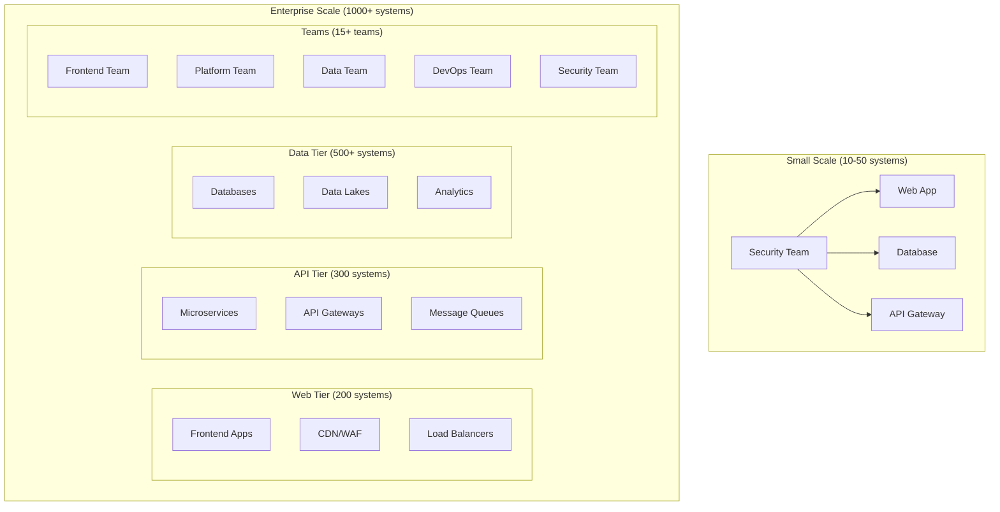
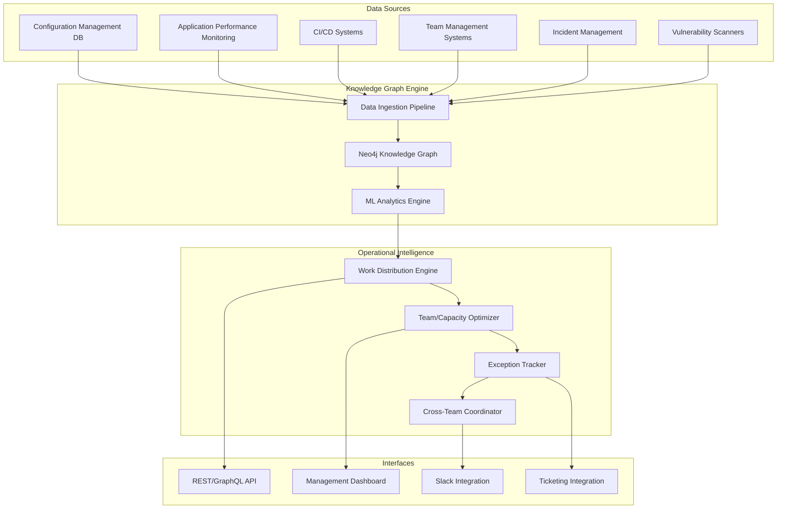

# Scale Operations Framework - Exception & Risk Management

**Intelligent work distribution and responsibility management for large technical fleets**

---

## 🎯 Executive Summary

Operating security at scale requires **intelligent work distribution** that understands technology relationships, team capabilities, and risk contexts. This framework introduces a **hybrid knowledge graph + operational intelligence system** that automatically groups technology, assigns responsibility, and manages exceptions across large technical fleets.

**Core Challenge**: How do you scale security operations from 10 systems to 10,000 systems without losing effectiveness or overwhelming teams?

**Solution**: **Technology Topology Intelligence** - A system that understands what you have, who should handle it, and how to route work intelligently.

---

## 🚧 Scale Operations Challenges

### **Current State Problems (At Scale)**

| Problem | Impact at 10 Systems | Impact at 1,000+ Systems |
|---------|---------------------|--------------------------|
| **Manual Work Assignment** | Manageable | Completely breaks down |
| **Risk Prioritization** | Simple triage | Complex multi-dimensional problem |
| **Knowledge Silos** | Team knows everything | Critical knowledge gaps emerge |
| **Exception Tracking** | Spreadsheets work | Becomes unmanageable |
| **Cross-Team Coordination** | Informal communication | Requires systematic orchestration |
| **Technology Relationships** | Everyone knows dependencies | Hidden complexity and blast radius |

### **Real-World Scale Scenarios**



**The Question**: When a critical vulnerability affects "Java applications using Log4j in production", which of the 847 Java services need immediate attention, which teams own them, and how do you coordinate the response?

---

## 🧠 Technology Topology Intelligence Framework

### **Core Components**

#### **1. Technology Knowledge Graph**

**Entities and Relationships**:
```python
# Technology Graph Schema
class TechnologyNode:
    system_id: str
    name: str
    type: TechnologyType  # service, database, infrastructure, etc.
    tech_stack: List[str]  # languages, frameworks, libraries
    criticality: CriticalityLevel
    environment: Environment  # prod, staging, dev
    owner_team: str
    backup_teams: List[str]
    
class Relationship:
    source: TechnologyNode
    target: TechnologyNode
    type: RelationType  # depends_on, communicates_with, hosts, etc.
    strength: float  # 0.0 to 1.0 relationship strength

# Example Technology Types
@enum
class TechnologyType:
    WEB_APPLICATION = "web_app"
    API_SERVICE = "api_service"
    DATABASE = "database"
    MESSAGE_QUEUE = "message_queue"
    INFRASTRUCTURE = "infrastructure"
    CI_CD_PIPELINE = "ci_cd"
    MONITORING_SYSTEM = "monitoring"
```

**Knowledge Graph Benefits**:
- **Impact Analysis**: "If this database goes down, what else is affected?"
- **Blast Radius Calculation**: "This vulnerability affects 47 systems owned by 8 teams"
- **Dependency Mapping**: "These 12 services all use the vulnerable library"
- **Team Coordination**: "Frontend and Platform teams need to coordinate on this fix"

#### **2. Team Topology Model**

```python
class Team:
    name: str
    capabilities: List[Capability]
    capacity: TeamCapacity
    expertise_areas: List[str]
    on_call_schedule: OnCallSchedule
    escalation_path: List[str]
    
class Capability:
    technology: str
    proficiency_level: ProficiencyLevel  # expert, competent, learning
    last_updated: datetime
    
class TeamCapacity:
    current_workload: float  # 0.0 to 1.0
    upcoming_capacity: float
    priority_threshold: PriorityLevel
    max_concurrent_incidents: int
```

**Team Intelligence**:
- **Expertise Matching**: Route Java vulnerabilities to teams with Java expertise
- **Capacity Awareness**: Don't overload teams already handling critical incidents
- **Skill Development**: Track and develop team capabilities over time
- **Cross-Training**: Identify backup teams for critical technologies

#### **3. Risk Context Engine**

```python
class RiskAssessment:
    asset: TechnologyNode
    vulnerability: Vulnerability
    business_impact: BusinessImpact
    exploit_probability: float
    remediation_complexity: RemediationComplexity
    regulatory_requirements: List[Compliance]
    
class BusinessImpact:
    revenue_impact: float
    customer_impact: CustomerImpactLevel
    data_sensitivity: DataSensitivityLevel
    availability_requirements: SLA
    
class RemediationComplexity:
    estimated_effort: int  # hours
    required_expertise: List[str]
    coordination_complexity: CoordinationLevel
    testing_requirements: TestingLevel
```

**Risk Intelligence**:
- **Contextual Prioritization**: Critical customer-facing systems get priority
- **Effort Estimation**: Understand remediation complexity before assigning
- **Expertise Matching**: Match required skills to team capabilities
- **Coordination Planning**: Identify multi-team efforts upfront

### **4. Intelligent Work Router**

```python
class WorkDistributionEngine:
    def route_security_work(self, incident: SecurityIncident) -> WorkAssignment:
        # 1. Analyze affected systems
        affected_systems = self.knowledge_graph.find_affected_systems(incident)
        
        # 2. Group by logical boundaries
        work_groups = self.group_systems_intelligently(affected_systems)
        
        # 3. Match teams to work groups
        team_assignments = self.match_teams_to_work(work_groups)
        
        # 4. Optimize for capacity and expertise
        optimized_assignment = self.optimize_assignment(team_assignments)
        
        return optimized_assignment
        
    def group_systems_intelligently(self, systems: List[TechnologyNode]) -> List[WorkGroup]:
        # Group by multiple dimensions:
        # - Technology stack similarity
        # - Team ownership boundaries
        # - Architectural boundaries (microservices, data tier, etc.)
        # - Risk level and urgency
        # - Dependency relationships
        pass
```

---

## 🏗️ Implementation Architecture

### **Hybrid Knowledge Graph + Operational Intelligence**



### **Knowledge Graph Schema Design**

**Core Entity Types**:
```cypher
// Technology Assets
CREATE (app:Application {
    name: "user-service",
    tech_stack: ["Java", "Spring Boot", "PostgreSQL"],
    criticality: "HIGH",
    environment: "production"
})

// Teams
CREATE (team:Team {
    name: "Platform Engineering",
    expertise: ["Java", "Kubernetes", "PostgreSQL"],
    capacity: 0.75,
    timezone: "America/Chicago"
})

// Relationships
CREATE (app)-[:OWNED_BY]->(team)
CREATE (app)-[:DEPENDS_ON]->(db:Database {name: "user-db"})
CREATE (app)-[:COMMUNICATES_WITH]->(auth:Service {name: "auth-service"})

// Vulnerabilities and Risks
CREATE (vuln:Vulnerability {
    cve: "CVE-2021-44228",
    severity: "CRITICAL",
    affected_component: "log4j"
})

CREATE (app)-[:HAS_VULNERABILITY]->(vuln)
```

**Query Examples**:
```cypher
// Find all systems affected by Log4j vulnerability
MATCH (v:Vulnerability {affected_component: "log4j"})<-[:HAS_VULNERABILITY]-(s:System)
RETURN s.name, s.owner_team, s.criticality

// Calculate blast radius for a system outage
MATCH (s:System {name: "user-service"})<-[:DEPENDS_ON*1..3]-(dependent)
RETURN dependent.name, dependent.criticality

// Find teams with Java expertise and available capacity
MATCH (t:Team)
WHERE "Java" IN t.expertise AND t.capacity < 0.8
RETURN t.name, t.capacity, t.timezone

// Identify coordination requirements
MATCH (v:Vulnerability)<-[:HAS_VULNERABILITY]-(s:System)-[:OWNED_BY]->(t:Team)
WITH v, collect(DISTINCT t.name) as affected_teams
WHERE size(affected_teams) > 1
RETURN v.cve, affected_teams
```

---

## 🎯 Intelligent Work Distribution Patterns

### **Pattern 1: Technology Stack Grouping**

```python
class TechnologyStackGrouper:
    def group_by_stack(self, systems: List[System]) -> Dict[str, List[System]]:
        """Group systems by similar technology stacks"""
        groups = defaultdict(list)
        
        for system in systems:
            # Create composite key from tech stack
            stack_key = self.normalize_stack(system.tech_stack)
            groups[stack_key].append(system)
            
        return groups
    
    def normalize_stack(self, tech_stack: List[str]) -> str:
        """Create normalized stack identifier"""
        # Group similar technologies
        # Java + Spring Boot + PostgreSQL -> "java_web_postgresql"
        # Node.js + Express + MongoDB -> "node_web_mongodb"
        # Python + Django + Redis -> "python_web_redis"
        pass

# Result: Teams get work grouped by their expertise areas
# Frontend team gets React/TypeScript vulnerabilities
# Backend team gets Java/Spring Boot issues
# Data team gets database/analytics problems
```

### **Pattern 2: Architectural Boundary Grouping**

```python
class ArchitecturalBoundaryGrouper:
    def group_by_architecture(self, systems: List[System]) -> Dict[str, List[System]]:
        """Group by architectural boundaries and service domains"""
        
        # Analyze system relationships in knowledge graph
        architectural_groups = {
            "user_domain": self.find_user_related_services(),
            "payment_domain": self.find_payment_related_services(),
            "content_domain": self.find_content_related_services(),
            "infrastructure": self.find_infrastructure_systems()
        }
        
        return architectural_groups

# Result: Work is grouped by business domain
# User team handles user authentication, profiles, preferences
# Payments team handles billing, transactions, fraud detection
# Infrastructure team handles networking, monitoring, deployment
```

### **Pattern 3: Risk-Based Prioritization**

```python
class RiskBasedRouter:
    def prioritize_work(self, work_groups: List[WorkGroup]) -> List[PrioritizedWork]:
        """Prioritize work based on risk assessment"""
        
        prioritized = []
        for group in work_groups:
            risk_score = self.calculate_risk_score(group)
            business_impact = self.assess_business_impact(group)
            remediation_complexity = self.estimate_complexity(group)
            
            priority = self.calculate_priority(
                risk=risk_score,
                impact=business_impact,
                complexity=remediation_complexity,
                regulatory_requirements=group.compliance_requirements
            )
            
            prioritized.append(PrioritizedWork(
                work_group=group,
                priority=priority,
                recommended_team=self.match_optimal_team(group),
                estimated_effort=remediation_complexity.effort,
                coordination_required=self.needs_coordination(group)
            ))
            
        return sorted(prioritized, key=lambda x: x.priority, reverse=True)

# Result: Critical customer-facing systems get immediate attention
# Non-prod environments get scheduled maintenance windows
# Complex multi-team efforts get proper coordination planning
```

### **Pattern 4: Team Capacity Optimization**

```python
class TeamCapacityOptimizer:
    def optimize_assignments(self, prioritized_work: List[PrioritizedWork]) -> List[WorkAssignment]:
        """Optimize work assignments considering team capacity and expertise"""
        
        assignments = []
        team_workloads = self.get_current_team_workloads()
        
        for work in prioritized_work:
            # Find teams with required expertise
            capable_teams = self.find_capable_teams(work.required_expertise)
            
            # Score teams by expertise + available capacity
            team_scores = []
            for team in capable_teams:
                expertise_score = self.calculate_expertise_match(team, work)
                capacity_score = self.calculate_capacity_availability(team)
                timezone_score = self.calculate_timezone_alignment(team, work.urgency)
                
                total_score = (
                    expertise_score * 0.5 +
                    capacity_score * 0.3 +
                    timezone_score * 0.2
                )
                
                team_scores.append((team, total_score))
            
            # Assign to highest scoring team with capacity
            best_team = max(team_scores, key=lambda x: x[1])[0]
            
            if self.has_capacity(best_team, work):
                assignments.append(WorkAssignment(
                    work=work,
                    primary_team=best_team,
                    backup_team=self.find_backup_team(work),
                    estimated_completion=self.estimate_completion(work, best_team)
                ))
                
                # Update team workload tracking
                team_workloads[best_team.name] += work.estimated_effort
            else:
                # Queue for later or escalate if critical
                if work.priority > 0.9:  # Critical
                    assignments.append(self.create_escalation(work))
                else:
                    self.queue_for_next_available(work)
        
        return assignments
```

---

## 🔧 Technology Implementation Stack

### **Recommended Technology Stack**

| Component | Technology Choice | Reasoning |
|-----------|------------------|-----------|
| **Knowledge Graph** | Neo4j + Graph Data Science | - Excellent relationship queries<br/>- ML capabilities for pattern detection<br/>- Scales to millions of nodes/relationships |
| **Data Pipeline** | Apache Kafka + Apache Airflow | - Real-time system updates<br/>- Reliable batch processing<br/>- Integration with existing tools |
| **API Layer** | FastAPI + GraphQL | - High performance REST API<br/>- Flexible querying with GraphQL<br/>- Auto-generated documentation |
| **ML/Analytics** | Python + scikit-learn + NetworkX | - Graph analysis algorithms<br/>- Risk scoring models<br/>- Team optimization algorithms |
| **UI Dashboard** | React + D3.js + Cytoscape.js | - Interactive graph visualization<br/>- Real-time updates<br/>- Responsive design |
| **Integration** | Slack Bot + Webhook APIs | - Team communication integration<br/>- Ticketing system integration<br/>- CMDB/APM connectors |

### **Data Sources Integration**

```python
class DataIngestionPipeline:
    """Ingest data from multiple sources into knowledge graph"""
    
    async def ingest_cmdb_data(self):
        """Import configuration management data"""
        # ServiceNow, Remedy, or custom CMDB
        systems = await self.cmdb_client.get_all_systems()
        for system in systems:
            await self.graph.create_or_update_system(system)
    
    async def ingest_apm_data(self):
        """Import application performance monitoring data"""
        # Datadog, New Relic, Dynatrace
        dependencies = await self.apm_client.get_service_dependencies()
        for dep in dependencies:
            await self.graph.create_dependency_relationship(dep)
    
    async def ingest_team_data(self):
        """Import team structure and capabilities"""
        # HR systems, Slack, PagerDuty
        teams = await self.hr_client.get_team_structure()
        for team in teams:
            await self.graph.create_or_update_team(team)
    
    async def ingest_vulnerability_data(self):
        """Import vulnerability scan results"""
        # Nessus, Qualys, security scanners
        vulns = await self.vuln_scanner.get_latest_vulnerabilities()
        for vuln in vulns:
            await self.graph.create_vulnerability_relationship(vuln)
```

---

## 📊 Exception & Risk Management Framework

### **Exception Tracking System**

```python
class ExceptionManager:
    """Track and manage security exceptions at scale"""
    
    async def create_exception(self, request: ExceptionRequest) -> SecurityException:
        """Create new security exception with risk assessment"""
        
        # Analyze risk context using knowledge graph
        risk_context = await self.analyze_risk_context(request.asset)
        business_justification = await self.validate_business_case(request)
        compensating_controls = await self.identify_compensating_controls(request)
        
        exception = SecurityException(
            id=generate_id(),
            asset=request.asset,
            vulnerability=request.vulnerability,
            business_justification=business_justification,
            compensating_controls=compensating_controls,
            risk_score=risk_context.risk_score,
            expiration_date=request.expiration_date,
            approval_required=self.determine_approval_level(risk_context),
            monitoring_requirements=self.define_monitoring(risk_context)
        )
        
        # Route for appropriate approval
        await self.route_for_approval(exception)
        
        return exception
    
    async def analyze_risk_context(self, asset: TechnologyNode) -> RiskContext:
        """Analyze risk using knowledge graph"""
        
        # Query graph for context
        query = """
        MATCH (asset:System {id: $asset_id})
        OPTIONAL MATCH (asset)-[:DEPENDS_ON*1..2]->(dep:System)
        OPTIONAL MATCH (asset)-[:COMMUNICATES_WITH]->(comm:System)
        OPTIONAL MATCH (asset)-[:PROCESSES]->(data:DataStore)
        RETURN asset, collect(dep) as dependencies, 
               collect(comm) as communications, collect(data) as data_stores
        """
        
        result = await self.neo4j.run(query, asset_id=asset.id)
        
        # Calculate blast radius
        blast_radius = len(result['dependencies']) + len(result['communications'])
        
        # Assess data sensitivity
        data_sensitivity = max([ds.sensitivity_level for ds in result['data_stores']], default=0)
        
        # Calculate composite risk score
        risk_score = self.calculate_risk_score(
            asset_criticality=asset.criticality,
            blast_radius=blast_radius,
            data_sensitivity=data_sensitivity,
            environment=asset.environment
        )
        
        return RiskContext(
            risk_score=risk_score,
            blast_radius=blast_radius,
            data_sensitivity=data_sensitivity,
            affected_systems=result['dependencies'] + result['communications']
        )
```

### **Risk Aggregation Dashboard**

```python
class RiskAggregationEngine:
    """Aggregate and visualize risks across the technology fleet"""
    
    async def generate_risk_dashboard(self) -> RiskDashboard:
        """Generate comprehensive risk view"""
        
        # Technology domain risks
        domain_risks = await self.calculate_domain_risks()
        
        # Team risk exposure
        team_risks = await self.calculate_team_risk_exposure()
        
        # Critical path analysis
        critical_paths = await self.identify_critical_paths()
        
        # Exception risk accumulation
        exception_risks = await self.assess_exception_risk_accumulation()
        
        return RiskDashboard(
            overall_risk_score=self.calculate_overall_risk(),
            domain_breakdown=domain_risks,
            team_exposure=team_risks,
            critical_systems=critical_paths,
            exception_risk=exception_risks,
            trending_data=await self.get_risk_trends()
        )
    
    async def calculate_domain_risks(self) -> Dict[str, DomainRisk]:
        """Calculate risk by technology domain"""
        
        query = """
        MATCH (s:System)-[:BELONGS_TO]->(d:Domain)
        OPTIONAL MATCH (s)-[:HAS_VULNERABILITY]->(v:Vulnerability)
        OPTIONAL MATCH (s)-[:HAS_EXCEPTION]->(e:Exception)
        RETURN d.name as domain,
               avg(s.criticality) as avg_criticality,
               count(v) as vulnerability_count,
               count(e) as exception_count,
               collect(s) as systems
        """
        
        results = await self.neo4j.run(query)
        
        domain_risks = {}
        for result in results:
            domain_name = result['domain']
            
            # Calculate domain risk score
            risk_score = self.calculate_domain_risk_score(
                avg_criticality=result['avg_criticality'],
                vulnerability_count=result['vulnerability_count'],
                exception_count=result['exception_count'],
                system_count=len(result['systems'])
            )
            
            domain_risks[domain_name] = DomainRisk(
                domain=domain_name,
                risk_score=risk_score,
                system_count=len(result['systems']),
                vulnerability_count=result['vulnerability_count'],
                exception_count=result['exception_count']
            )
        
        return domain_risks
```

---

## 🚀 Implementation Roadmap

### **Phase 1: Knowledge Graph Foundation (Weeks 1-4)**

**Goals**: Build core knowledge graph with basic technology and team relationships

**Key Activities**:
- [ ] Deploy Neo4j cluster with Graph Data Science extensions
- [ ] Design core graph schema (systems, teams, relationships)
- [ ] Build data ingestion pipeline for CMDB and team data
- [ ] Create basic graph visualization dashboard
- [ ] Implement fundamental queries (find system, show dependencies)

**Success Criteria**:
- ✅ Knowledge graph contains 100% of known systems
- ✅ Team ownership relationships are accurate
- ✅ Basic dependency mapping is functional
- ✅ Dashboard provides useful system views

### **Phase 2: Work Distribution Engine (Weeks 5-8)**

**Goals**: Implement intelligent work routing based on graph analysis

**Key Activities**:
- [ ] Build work distribution algorithms
- [ ] Implement team capacity tracking
- [ ] Create expertise matching logic
- [ ] Develop work grouping strategies
- [ ] Build Slack integration for notifications

**Success Criteria**:
- ✅ Security work is automatically grouped by technology stack
- ✅ Teams receive work matching their expertise areas
- ✅ Capacity overloads are prevented through smart routing
- ✅ Cross-team coordination needs are identified automatically

### **Phase 3: Risk Management Integration (Weeks 9-12)**

**Goals**: Add comprehensive risk assessment and exception management

**Key Activities**:
- [ ] Implement risk scoring algorithms
- [ ] Build exception tracking system
- [ ] Create risk aggregation dashboard
- [ ] Develop automated compliance reporting
- [ ] Integrate vulnerability management workflows

**Success Criteria**:
- ✅ Risk scores accurately reflect business impact and technical complexity
- ✅ Exceptions are tracked with appropriate controls and monitoring
- ✅ Executive risk dashboard provides actionable insights
- ✅ Compliance reporting is automated and accurate

### **Phase 4: Advanced Intelligence (Weeks 13-16)**

**Goals**: Add ML-powered insights and predictive capabilities

**Key Activities**:
- [ ] Implement ML models for risk prediction
- [ ] Build capacity planning algorithms
- [ ] Create performance optimization recommendations
- [ ] Develop team skill gap analysis
- [ ] Add predictive maintenance for exceptions

**Success Criteria**:
- ✅ System can predict which teams will be overloaded
- ✅ Risk trends are identified before they become critical
- ✅ Team development recommendations improve capability matching
- ✅ Exception renewal predictions prevent expiration surprises

---

## 📊 Success Metrics & KPIs

### **Operational Efficiency Metrics**

| Metric | Current State (Manual) | Target State (Automated) | Improvement |
|--------|----------------------|-------------------------|-------------|
| **Work Assignment Time** | 2-4 hours per incident | 5-10 minutes | 95% reduction |
| **Team Utilization** | Uneven (20-90% range) | Balanced (70-85% range) | 25% improvement |
| **Cross-Team Coordination** | Ad-hoc, often missed | Systematic, proactive | 80% fewer missed dependencies |
| **Exception Tracking** | Spreadsheets, manual | Automated, risk-aware | 100% visibility |
| **Risk Assessment Time** | 1-2 days for complex | 1-2 hours | 90% reduction |

### **Quality & Risk Metrics**

| Metric | Target | Measurement Method |
|---------|--------|--------------------|
| **Work Assignment Accuracy** | >95% | Team satisfaction surveys, rework rates |
| **Risk Score Accuracy** | >90% | Historical incident correlation |
| **Exception Risk Assessment** | >95% | Audit findings, incident analysis |
| **Team Expertise Matching** | >90% | Skills assessment, delivery quality |
| **Capacity Prediction Accuracy** | >85% | Actual vs predicted workloads |

### **Business Impact Metrics**

| Metric | Current | Target | Business Value |
|---------|---------|--------|----------------|
| **Mean Time to Resolution** | 8-24 hours | 2-6 hours | $2M+ annual value |
| **Security Team Productivity** | 60% manual tasks | 80% strategic work | $1.5M+ annual value |
| **Compliance Audit Preparation** | 2-3 weeks | 2-3 days | $500K+ annual value |
| **Risk Exception Management** | Manual, error-prone | Automated, auditable | $800K+ risk reduction |
| **Cross-Team Coordination Costs** | High overhead | Minimal friction | $1M+ efficiency gains |

---

## 🎯 Key Success Factors

### **Technical Excellence**
- **Graph Design**: Well-structured schema that evolves with organizational needs
- **Data Quality**: Accurate, timely data from authoritative sources
- **Performance**: Sub-second queries even at enterprise scale
- **Integration**: Seamless connections with existing tools and workflows

### **Organizational Adoption**
- **User Experience**: Intuitive interfaces that make complex operations simple
- **Trust Building**: Transparent algorithms that teams understand and trust
- **Change Management**: Gradual rollout with clear value demonstration
- **Continuous Learning**: System improves based on feedback and results

### **Risk Management**
- **Conservative Approach**: Start with low-risk automation and build confidence
- **Human Oversight**: Maintain human judgment for critical decisions
- **Audit Trail**: Complete visibility into all decisions and recommendations
- **Fail-Safe Design**: System degradation doesn't compromise security operations

---

**This framework transforms security operations from manual work distribution to intelligent, automated orchestration that scales with organizational growth while maintaining effectiveness and team satisfaction.**