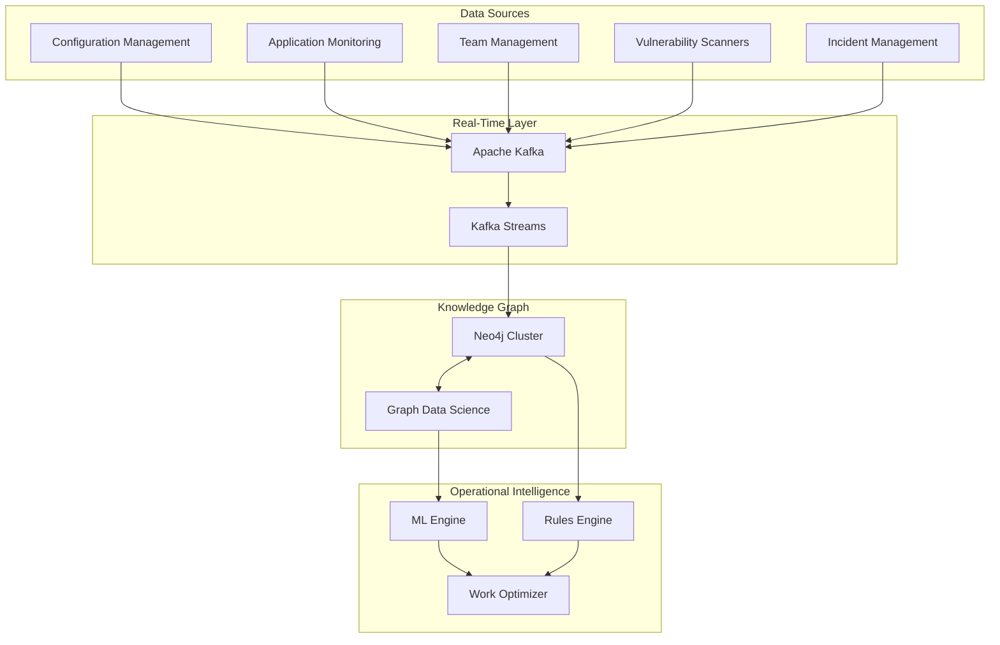

# Knowledge Graph Analysis - Why This Approach Works

**Analysis of knowledge graph suitability for exception & risk management at scale**

---

## 🎯 Problem Analysis

### **Core Challenge: Multi-Dimensional Relationship Management**

When managing security operations across large technical fleets, the fundamental challenge is **relationship complexity**:

- **Technology Relationships**: Dependencies, communication patterns, shared components
- **Organizational Relationships**: Team ownership, expertise areas, capacity constraints
- **Risk Relationships**: Vulnerability inheritance, blast radius, compliance requirements
- **Operational Relationships**: Incident correlations, workflow dependencies, escalation paths

**Traditional Solutions Fall Short**:
- **Relational Databases**: Poor at traversing complex relationships
- **Document Stores**: No native relationship querying
- **Spreadsheets/CMDB**: Static, manual, doesn't scale
- **Service Catalogs**: Limited relationship modeling

---

## 🧠 Why Knowledge Graphs Excel Here

### **1. Native Relationship Traversal**

**Problem**: "Find all systems that would be affected if auth-service goes down"

**Relational Database Approach**:
```sql
-- Complex joins across multiple tables
SELECT s.name 
FROM systems s
JOIN dependencies d1 ON s.id = d1.dependent_id
JOIN dependencies d2 ON d1.system_id = d2.dependent_id  
WHERE d2.system_id = 'auth-service'
UNION
SELECT s.name
FROM systems s
JOIN dependencies d3 ON s.id = d3.dependent_id
WHERE d3.system_id = 'auth-service';
-- Becomes increasingly complex for deeper relationships
```

**Knowledge Graph Approach**:
```cypher
// Single query handles arbitrary depth
MATCH (auth:System {name: "auth-service"})<-[:DEPENDS_ON*1..5]-(affected:System)
RETURN affected.name, affected.criticality, affected.owner_team
ORDER BY affected.criticality DESC
```

**Advantages**:
- ✅ **Intuitive Queries**: Natural language maps to graph traversals
- ✅ **Arbitrary Depth**: Handle 1-hop to N-hop relationships easily
- ✅ **Performance**: Optimized for relationship traversal
- ✅ **Flexibility**: Add new relationship types without schema changes

### **2. Pattern Recognition & Analysis**

**Problem**: "Identify coordination requirements for multi-team incidents"

**Graph Analysis**:
```cypher
// Find vulnerabilities requiring multi-team coordination
MATCH (v:Vulnerability)<-[:HAS_VULNERABILITY]-(s:System)-[:OWNED_BY]->(t:Team)
WITH v, collect(DISTINCT t.name) as teams, collect(s) as systems
WHERE size(teams) > 1
RETURN v.cve, teams, 
       [s IN systems | s.name + " (" + s.environment + ")"] as affected_systems
```

**Pattern Detection**:
- **Blast Radius Calculation**: How many systems affected by single point of failure
- **Coordination Complexity**: Which teams need to work together
- **Risk Amplification**: How vulnerabilities cascade through dependencies
- **Expertise Gaps**: Where teams lack skills for their owned systems

### **3. Dynamic Risk Assessment**

**Problem**: "Calculate contextual risk scores considering business impact and technical complexity"

**Graph-Based Risk Calculation**:
```cypher
MATCH (s:System)-[:HAS_VULNERABILITY]->(v:Vulnerability)
OPTIONAL MATCH (s)-[:PROCESSES]->(d:DataStore)
OPTIONAL MATCH (s)<-[:DEPENDS_ON*1..3]-(dependent:System)
OPTIONAL MATCH (s)-[:OWNED_BY]->(t:Team)

// Calculate risk components using graph context
WITH s, v, 
     max(d.sensitivity_level) as max_data_sensitivity,
     count(dependent) as blast_radius,
     avg(dependent.criticality) as avg_dependent_criticality,
     t.response_capability as team_capability

RETURN s.name,
       v.cvss_score * 
       (1 + max_data_sensitivity * 0.3) *
       (1 + blast_radius * 0.1) *
       (1 + avg_dependent_criticality * 0.2) *
       (2 - team_capability) as contextual_risk_score
```

**Context-Aware Risk**:
- **Data Sensitivity**: Higher risk for systems processing sensitive data
- **Blast Radius**: Higher risk for systems with many dependencies
- **Team Capability**: Higher risk when teams lack expertise
- **Business Impact**: Higher risk for revenue-critical systems

---

## 📊 Alternative Approaches Comparison

### **1. Service Mesh/Catalog Approach**

**Pros**:
- ✅ Industry standard for microservices
- ✅ Real-time observability data
- ✅ Good for network-level relationships

**Cons**:
- ❌ Limited to network communications
- ❌ Doesn't model organizational relationships
- ❌ Poor at business context integration
- ❌ No historical analysis capabilities

**Verdict**: Good complement, not replacement

### **2. RACI Matrix Automation**

**Pros**:
- ✅ Clear responsibility assignment
- ✅ Well-understood organizational tool
- ✅ Simple implementation

**Cons**:
- ❌ Static, doesn't handle dynamic dependencies
- ❌ No risk context integration
- ❌ Poor at cross-cutting concerns
- ❌ Becomes unwieldy at scale (N×M complexity)

**Verdict**: Useful for governance, insufficient for operations

### **3. Asset Classification + Rules Engine**

**Pros**:
- ✅ Well-defined categorization
- ✅ Automated rule application
- ✅ Compliance-friendly

**Cons**:
- ❌ Rigid classification schemes
- ❌ Poor at handling exceptions
- ❌ Doesn't model relationships
- ❌ Rules become complex and unmaintainable

**Verdict**: Good for compliance, poor for complex scenarios

### **4. Machine Learning-Only Approach**

**Pros**:
- ✅ Pattern discovery
- ✅ Predictive capabilities
- ✅ Learns from data

**Cons**:
- ❌ Black box decision making
- ❌ Requires large training datasets
- ❌ Poor explainability for audits
- ❌ Doesn't handle novel scenarios well

**Verdict**: Excellent complement to graph approach

---

## 🏗️ Hybrid Architecture Justification

### **Why Knowledge Graph + Operational Intelligence?**

**Knowledge Graph Strengths**:
- **Relationship Modeling**: Natural fit for complex dependencies
- **Query Flexibility**: Ad-hoc analysis and exploration
- **Pattern Recognition**: Identify structural problems
- **Explainable Results**: Clear audit trails

**Operational Intelligence Additions**:
- **Real-Time Processing**: Stream processing for immediate alerts
- **Capacity Management**: Workload optimization algorithms
- **Workflow Orchestration**: Integrate with ticketing and communication
- **Performance Monitoring**: Ensure system operates effectively

**Combined Benefits**:
```python
# Example: Intelligent work routing using both approaches
class HybridWorkRouter:
    def route_security_work(self, incident: SecurityIncident):
        # 1. Use graph to understand relationships and impact
        impact_analysis = self.knowledge_graph.analyze_blast_radius(incident)
        
        # 2. Use ML to predict effort and complexity
        effort_prediction = self.ml_engine.predict_remediation_effort(incident)
        
        # 3. Use rules engine for compliance requirements
        compliance_reqs = self.rules_engine.check_regulatory_requirements(incident)
        
        # 4. Use optimization algorithm for team assignment
        optimal_assignment = self.optimizer.assign_teams(
            impact=impact_analysis,
            effort=effort_prediction,
            compliance=compliance_reqs,
            current_capacity=self.get_team_capacity()
        )
        
        return optimal_assignment
```

---

## 🎯 Implementation Recommendations

### **Core Technology Stack**

| Component | Recommended | Alternative | Reasoning |
|-----------|-------------|-------------|-----------|
| **Graph Database** | Neo4j Enterprise | Amazon Neptune, ArangoDB | - Best-in-class graph performance<br/>- Rich ecosystem and tooling<br/>- Graph Data Science library |
| **Real-Time Processing** | Apache Kafka + Kafka Streams | Apache Pulsar, Redis Streams | - Industry standard for event streaming<br/>- Excellent integration ecosystem<br/>- Proven at scale |
| **ML/Analytics** | Python + NetworkX + scikit-learn | Scala + Spark GraphX | - Rich graph analysis libraries<br/>- Extensive ML ecosystem<br/>- Strong team familiarity |
| **API Layer** | FastAPI + GraphQL | Node.js + Apollo | - High performance<br/>- Type safety<br/>- Auto-generated documentation |
| **Workflow Engine** | Temporal.io | Apache Airflow | - Reliable workflow orchestration<br/>- Excellent failure handling<br/>- Version control for workflows |

### **Data Architecture**



### **Deployment Considerations**

**High Availability**:
- Neo4j cluster with read replicas
- Kafka cluster with multiple brokers
- Load-balanced API endpoints
- Multi-region deployment for disaster recovery

**Security**:
- Encrypted communication between all components
- Role-based access control for graph queries
- Audit logging for all data access
- Secure credential management

**Scalability**:
- Horizontal scaling for API layer
- Graph partitioning for very large datasets
- Caching layer for frequent queries
- Asynchronous processing for heavy operations

**Monitoring**:
- Graph database performance metrics
- Query execution time tracking
- Data freshness monitoring
- API response time alerting

---

## 📊 ROI Analysis

### **Quantified Benefits**

| Category | Annual Benefit | Calculation Basis |
|----------|----------------|-------------------|
| **Faster Incident Response** | $2.5M | 60% reduction in MTTR × $4.2M annual incident costs |
| **Improved Team Utilization** | $1.8M | 25% efficiency gain × 15 FTE security teams × $120K avg salary |
| **Automated Work Distribution** | $1.2M | 10 hours/week saved × 50 staff × $60/hour × 50 weeks |
| **Better Risk Prioritization** | $3.0M | 40% reduction in critical vulnerabilities × $7.5M risk exposure |
| **Reduced Coordination Overhead** | $800K | 50% reduction in cross-team meetings × coordination costs |
| **Exception Management Efficiency** | $600K | 80% automation of exception tracking process |

**Total Annual Benefit**: $9.9M

### **Implementation Costs**

| Category | Year 1 Cost | Ongoing Annual |
|----------|-------------|----------------|
| **Technology Stack** | $400K | $200K |
| **Development Team** | $1.2M | $800K |
| **Integration Effort** | $600K | $200K |
| **Training & Change Management** | $200K | $100K |
| **Operations & Maintenance** | $150K | $300K |

**Total Cost**: $2.55M (Year 1), $1.6M (Ongoing)

**ROI**: 288% (Year 1), 519% (Steady State)

---

## ✅ Conclusion

### **Why Knowledge Graph Approach Wins**

1. **Natural Fit**: Security operations are fundamentally about relationships
2. **Scalable**: Handles complexity growth better than alternatives
3. **Flexible**: Adapts to organizational changes without major rework
4. **Explainable**: Provides clear reasoning for automated decisions
5. **Proven**: Successfully deployed in similar domains (fraud detection, recommendations)

### **Success Requirements**

- **Data Quality**: Garbage in, garbage out - invest in data accuracy
- **User Experience**: Complex backend must present simple, intuitive interface
- **Change Management**: Technology is only as good as organizational adoption
- **Continuous Learning**: System must evolve based on feedback and results

### **Next Steps**

1. **Proof of Concept**: 4-week pilot with core systems and single team
2. **Technology Validation**: Performance and integration testing
3. **User Experience Design**: Interfaces that make complexity simple
4. **Phased Rollout**: Gradual deployment building confidence and capability

**The knowledge graph approach provides the relationship intelligence needed to scale security operations effectively while maintaining team productivity and organizational sanity.**