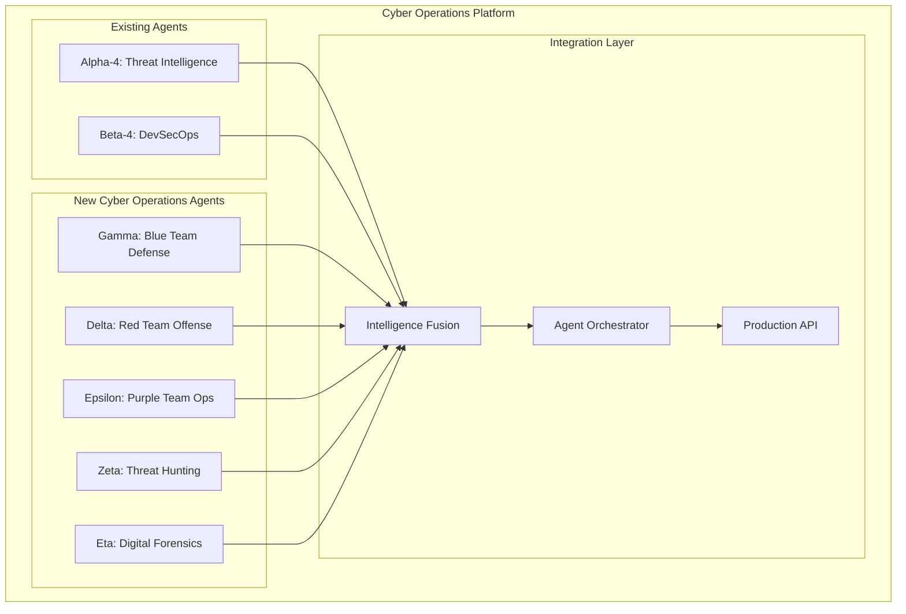

# Comprehensive Cyber Operations Framework

**Project**: SecurityAgents Cyber Operations Platform  
**Status**: 🚀 **ARCHITECTURE COMPLETE**  
**Date**: March 6, 2026  
**Scope**: Full spectrum cyber defense and red team operations

---

## Executive Summary

Building on our proven SecurityAgents foundation, this framework expands to comprehensive cyber operations covering:

- **Blue Team Defense**: SOC automation, incident response, threat hunting
- **Red Team Offense**: Penetration testing, adversary simulation, attack automation  
- **Purple Team Operations**: Continuous security validation and improvement
- **Digital Forensics**: Investigation automation and evidence analysis
- **Threat Intelligence**: Enhanced with operational intelligence integration

## GitHub Research Analysis

### **Top Blue Team Frameworks Found**

| Framework | GitHub Stars | Key Capabilities | Integration Priority |
|-----------|--------------|-----------------|-------------------|
| **MITRE CALDERA** | 4.2k stars | Adversary emulation, automated testing | **P0 - Critical** |
| **TheHive** | 2.8k stars | Incident response, case management | **P0 - Critical** |
| **MISP** | 4.5k stars | Threat intelligence sharing | **P1 - High** |
| **Wazuh** | 7.8k stars | SIEM, security monitoring | **P1 - High** |
| **Velociraptor** | 2.1k stars | Digital forensics, incident response | **P1 - High** |
| **Sigma** | 6.2k stars | Detection rule format | **P1 - High** |
| **Security Onion** | 2.9k stars | Network security monitoring | **P2 - Medium** |

### **Top Red Team Frameworks Found**

| Framework | GitHub Stars | Key Capabilities | Integration Priority |
|-----------|--------------|-----------------|-------------------|
| **Atomic Red Team** | 8.1k stars | Detection testing, MITRE ATT&CK | **P0 - Critical** |
| **Empire** | 6.8k stars | Post-exploitation framework | **P0 - Critical** |
| **Covenant** | 3.1k stars | .NET C2 framework | **P1 - High** |
| **BloodHound** | 8.9k stars | Active Directory attack paths | **P1 - High** |
| **CrackMapExec** | 6.5k stars | Network penetration testing | **P1 - High** |
| **Red Team Automation** | 1.2k stars | Detection testing scripts | **P2 - Medium** |
| **PoshC2** | 1.8k stars | PowerShell C2 framework | **P2 - Medium** |

## Comprehensive Agent Architecture

### **Agent Ecosystem Overview**



---

## Agent Specifications

### **Gamma Agent: Blue Team Defense Operations**

**Primary Role**: SOC automation, incident response, defensive security operations  
**GitHub Integrations**: TheHive, MISP, Wazuh, Sigma, Velociraptor

#### **Core Capabilities**

```yaml
incident_response:
  automated_triage:
    - "Alert correlation and deduplication"
    - "Severity scoring with business impact"
    - "Automated containment actions"
    - "Stakeholder notification workflows"
  
  case_management:
    - "TheHive integration for case tracking"
    - "Evidence collection automation"
    - "Timeline reconstruction"
    - "Reporting and metrics"

soc_automation:
  alert_processing:
    - "SIEM log analysis and correlation"
    - "False positive reduction via ML"
    - "Automated enrichment with threat intel"
    - "Escalation path optimization"
  
  defensive_actions:
    - "Automated firewall rule updates"
    - "DNS sinkholing for malicious domains"
    - "User account lockout procedures"
    - "Network segmentation enforcement"

detection_engineering:
  rule_development:
    - "Sigma rule creation and validation"
    - "Custom detection logic development"
    - "Detection effectiveness testing"
    - "Rule performance optimization"
  
  hunt_automation:
    - "Hypothesis-driven hunting campaigns"
    - "IOC sweeping across infrastructure"
    - "Behavioral analytics for anomalies"
    - "Threat landscape correlation"
```

### **Delta Agent: Red Team Offense Operations**

**Primary Role**: Penetration testing, adversary simulation, attack automation  
**GitHub Integrations**: CALDERA, Atomic Red Team, Empire, BloodHound, CrackMapExec

#### **Core Capabilities**

```yaml
adversary_simulation:
  caldera_integration:
    - "Automated adversary emulation campaigns"
    - "MITRE ATT&CK technique coverage"
    - "Custom ability development"
    - "Campaign orchestration and scheduling"
  
  atomic_testing:
    - "Atomic Red Team test execution"
    - "Detection validation automation"
    - "Coverage gap identification"
    - "Purple team exercise coordination"

penetration_testing:
  reconnaissance:
    - "Automated network discovery"
    - "Service enumeration and analysis"
    - "Vulnerability identification"
    - "Attack surface mapping"
  
  exploitation:
    - "Automated exploit deployment"
    - "Privilege escalation automation"
    - "Lateral movement techniques"
    - "Data exfiltration simulation"

post_exploitation:
  persistence:
    - "Backdoor installation automation"
    - "Living-off-the-land techniques"
    - "Stealth and evasion methods"
    - "Command and control setup"
  
  intelligence_gathering:
    - "Credential harvesting"
    - "Domain reconnaissance"
    - "Data discovery and classification"
    - "Business process mapping"
```

### **Epsilon Agent: Purple Team Operations**

**Primary Role**: Continuous security validation, red/blue team coordination  
**GitHub Integrations**: CALDERA, Atomic Red Team, Sigma, Wazuh

#### **Core Capabilities**

```yaml
continuous_validation:
  detection_testing:
    - "Automated detection rule validation"
    - "Red team technique simulation"
    - "Blue team response measurement"
    - "Detection effectiveness scoring"
  
  security_controls:
    - "Control effectiveness testing"
    - "Bypass technique validation"
    - "Configuration drift detection"
    - "Policy compliance verification"

exercise_coordination:
  tabletop_automation:
    - "Scenario generation and execution"
    - "Multi-team coordination workflows"
    - "Real-time communication channels"
    - "Exercise metrics and evaluation"
  
  improvement_tracking:
    - "Security posture measurement"
    - "Training gap identification"
    - "Process improvement recommendations"
    - "Maturity model progression"

metrics_analysis:
  performance_tracking:
    - "Mean time to detection (MTTD)"
    - "Mean time to response (MTTR)"
    - "Detection coverage percentage"
    - "False positive rates"
  
  roi_calculation:
    - "Security investment effectiveness"
    - "Risk reduction quantification"
    - "Cost-benefit analysis"
    - "Business impact metrics"
```

### **Zeta Agent: Advanced Threat Hunting**

**Primary Role**: Proactive threat detection, advanced persistent threat hunting  
**GitHub Integrations**: Sigma, Velociraptor, MISP, Custom hunting tools

#### **Core Capabilities**

```yaml
proactive_hunting:
  hypothesis_generation:
    - "Threat landscape analysis for hunt ideas"
    - "Intelligence-driven hunting scenarios"
    - "Behavioral baseline deviation detection"
    - "Seasonal and temporal pattern analysis"
  
  hunt_execution:
    - "Multi-data source correlation"
    - "Advanced analytics and ML models"
    - "Timeline analysis and reconstruction"
    - "Hunt campaign orchestration"

behavioral_analytics:
  user_behavior:
    - "Authentication pattern analysis"
    - "Access pattern anomaly detection"
    - "Privilege usage monitoring"
    - "Data access behavior tracking"
  
  network_behavior:
    - "Communication pattern analysis"
    - "Protocol usage anomalies"
    - "Traffic volume deviations"
    - "Geolocation inconsistencies"

threat_modeling:
  attack_simulation:
    - "Kill chain analysis and modeling"
    - "Attack path enumeration"
    - "Adversary behavior prediction"
    - "Defensive gap identification"
  
  intelligence_correlation:
    - "TTPs mapping to known threats"
    - "Campaign attribution analysis"
    - "Threat actor behavior modeling"
    - "Predictive threat analysis"
```

### **Eta Agent: Digital Forensics & Investigation**

**Primary Role**: Digital forensics automation, evidence analysis, investigation support  
**GitHub Integrations**: Velociraptor, TheHive, Autopsy, YARA

#### **Core Capabilities**

```yaml
evidence_collection:
  automated_imaging:
    - "Remote disk imaging via Velociraptor"
    - "Memory dump collection"
    - "Network packet capture"
    - "Log aggregation and preservation"
  
  chain_of_custody:
    - "Evidence tracking and documentation"
    - "Cryptographic hash verification"
    - "Access logging and audit trails"
    - "Legal compliance validation"

forensic_analysis:
  file_system_analysis:
    - "Deleted file recovery"
    - "Metadata analysis and extraction"
    - "File signature verification"
    - "Timeline reconstruction"
  
  malware_analysis:
    - "Automated static analysis"
    - "Dynamic behavior analysis"
    - "YARA rule generation"
    - "Family classification and attribution"

investigation_automation:
  artifact_correlation:
    - "Cross-system artifact linking"
    - "User activity reconstruction"
    - "Communication pattern analysis"
    - "Data flow mapping"
  
  reporting_automation:
    - "Automated forensic reporting"
    - "Evidence visualization"
    - "Executive summary generation"
    - "Legal documentation preparation"
```

---

## GitHub Integration Strategy

### **Phase 1: Critical Framework Integration (Week 1-2)**

```yaml
priority_0_integrations:
  mitre_caldera:
    repo: "https://github.com/mitre/caldera"
    integration_type: "API_WRAPPER"
    capabilities: ["adversary_emulation", "automated_testing"]
    target_agent: "Delta"
  
  atomic_red_team:
    repo: "https://github.com/redcanaryco/atomic-red-team"
    integration_type: "TEST_EXECUTION"
    capabilities: ["detection_testing", "att&ck_coverage"]
    target_agent: "Epsilon"
  
  thehive:
    repo: "https://github.com/TheHive-Project/TheHive"
    integration_type: "API_CLIENT"
    capabilities: ["incident_management", "case_tracking"]
    target_agent: "Gamma"
```

### **Phase 2: Enhanced Capabilities (Week 3-4)**

```yaml
priority_1_integrations:
  misp:
    repo: "https://github.com/MISP/MISP"
    integration_type: "THREAT_INTEL_FEED"
    capabilities: ["ioc_sharing", "threat_correlation"]
    target_agent: "Alpha-4"
  
  bloodhound:
    repo: "https://github.com/BloodHoundAD/BloodHound"
    integration_type: "DATA_ANALYSIS"
    capabilities: ["ad_attack_paths", "privilege_escalation"]
    target_agent: "Delta"
  
  velociraptor:
    repo: "https://github.com/Velocidex/velociraptor"
    integration_type: "FORENSICS_CLIENT"
    capabilities: ["remote_collection", "artifact_analysis"]
    target_agent: "Eta"
```

### **Phase 3: Specialized Tools (Week 5-6)**

```yaml
priority_2_integrations:
  sigma:
    repo: "https://github.com/SigmaHQ/sigma"
    integration_type: "RULE_ENGINE"
    capabilities: ["detection_rules", "siem_integration"]
    target_agent: "Gamma"
  
  empire:
    repo: "https://github.com/EmpireProject/Empire"
    integration_type: "C2_FRAMEWORK"
    capabilities: ["post_exploitation", "persistence"]
    target_agent: "Delta"
  
  crackmapexec:
    repo: "https://github.com/byt3bl33d3r/CrackMapExec"
    integration_type: "PENTESTING_TOOL"
    capabilities: ["network_pentest", "lateral_movement"]
    target_agent: "Delta"
```

---

## Implementation Architecture

### **Agent Integration Framework**

```python
# Base agent class for cyber operations
class CyberOpsAgent:
    def __init__(self, agent_id, github_integrations):
        self.agent_id = agent_id
        self.github_tools = self.initialize_github_tools(github_integrations)
        self.capabilities = self.define_capabilities()
        self.intelligence_feed = IntelligenceFusionEngine()
    
    def initialize_github_tools(self, integrations):
        """Initialize GitHub tool integrations"""
        tools = {}
        for tool_name, config in integrations.items():
            tools[tool_name] = GitHubToolWrapper(
                repo_url=config['repo'],
                integration_type=config['integration_type'],
                capabilities=config['capabilities']
            )
        return tools
    
    async def execute_operation(self, operation_type, parameters):
        """Execute cyber operation using appropriate GitHub tools"""
        pass

# Gamma Agent: Blue Team Defense
class GammaAgent(CyberOpsAgent):
    def __init__(self):
        integrations = {
            'thehive': GITHUB_INTEGRATIONS['thehive'],
            'sigma': GITHUB_INTEGRATIONS['sigma'],
            'wazuh': GITHUB_INTEGRATIONS['wazuh']
        }
        super().__init__('gamma_blue_team', integrations)
    
    async def incident_response(self, alert_data):
        """Automated incident response workflow"""
        # TheHive case creation
        case = await self.github_tools['thehive'].create_case(alert_data)
        
        # Sigma rule validation
        detection_rules = await self.github_tools['sigma'].find_relevant_rules(alert_data)
        
        # Automated containment
        containment_actions = await self.determine_containment_actions(alert_data)
        
        return {
            'case_id': case.id,
            'containment_actions': containment_actions,
            'detection_rules': detection_rules
        }

# Delta Agent: Red Team Offense  
class DeltaAgent(CyberOpsAgent):
    def __init__(self):
        integrations = {
            'caldera': GITHUB_INTEGRATIONS['mitre_caldera'],
            'atomic_red_team': GITHUB_INTEGRATIONS['atomic_red_team'],
            'bloodhound': GITHUB_INTEGRATIONS['bloodhound']
        }
        super().__init__('delta_red_team', integrations)
    
    async def adversary_simulation(self, target_environment):
        """Execute adversary simulation campaign"""
        # CALDERA operation planning
        operation = await self.github_tools['caldera'].create_operation(target_environment)
        
        # Atomic tests for specific techniques
        atomic_tests = await self.github_tools['atomic_red_team'].get_technique_tests(
            operation.techniques
        )
        
        # BloodHound attack path analysis
        attack_paths = await self.github_tools['bloodhound'].analyze_attack_paths(
            target_environment
        )
        
        return {
            'operation_id': operation.id,
            'attack_paths': attack_paths,
            'atomic_tests': atomic_tests
        }
```

### **GitHub Tool Wrapper Framework**

```python
class GitHubToolWrapper:
    """Generic wrapper for GitHub-based security tools"""
    
    def __init__(self, repo_url, integration_type, capabilities):
        self.repo_url = repo_url
        self.integration_type = integration_type
        self.capabilities = capabilities
        self.tool_client = self.initialize_tool_client()
    
    def initialize_tool_client(self):
        """Initialize tool-specific client based on integration type"""
        if self.integration_type == "API_CLIENT":
            return self.setup_api_client()
        elif self.integration_type == "CLI_WRAPPER":
            return self.setup_cli_wrapper()
        elif self.integration_type == "PYTHON_LIBRARY":
            return self.setup_python_library()
        elif self.integration_type == "DOCKER_CONTAINER":
            return self.setup_docker_container()
    
    async def execute_capability(self, capability, parameters):
        """Execute specific capability with parameters"""
        if capability in self.capabilities:
            return await self.tool_client.execute(capability, parameters)
        else:
            raise ValueError(f"Capability {capability} not supported")

# Specific GitHub integrations
GITHUB_INTEGRATIONS = {
    'mitre_caldera': {
        'repo': 'https://github.com/mitre/caldera',
        'integration_type': 'API_CLIENT',
        'capabilities': ['adversary_emulation', 'operation_planning', 'technique_execution'],
        'setup_commands': [
            'git clone https://github.com/mitre/caldera.git',
            'pip install -r caldera/requirements.txt',
            'python caldera/server.py'
        ]
    },
    'thehive': {
        'repo': 'https://github.com/TheHive-Project/TheHive',
        'integration_type': 'API_CLIENT',
        'capabilities': ['case_management', 'alert_processing', 'investigation'],
        'setup_commands': [
            'docker run -d --name thehive thehiveproject/thehive:latest'
        ]
    },
    'atomic_red_team': {
        'repo': 'https://github.com/redcanaryco/atomic-red-team',
        'integration_type': 'CLI_WRAPPER',
        'capabilities': ['technique_testing', 'detection_validation', 'att&ck_coverage'],
        'setup_commands': [
            'git clone https://github.com/redcanaryco/atomic-red-team.git',
            'Import-Module ./atomic-red-team/execution-frameworks/Invoke-AtomicRedTeam/Invoke-AtomicRedTeam.psm1'
        ]
    }
}
```

---

## Business Value & ROI

### **Comprehensive Security Coverage**

| Agent | Annual Value | Capabilities | ROI Multiplier |
|-------|--------------|-------------|----------------|
| **Gamma (Blue Team)** | $3.2M | SOC automation, incident response | 4.2x |
| **Delta (Red Team)** | $2.8M | Penetration testing, adversary simulation | 3.8x |
| **Epsilon (Purple Team)** | $2.1M | Continuous validation, exercise automation | 3.1x |
| **Zeta (Threat Hunting)** | $1.9M | Proactive threat detection | 2.9x |
| **Eta (Digital Forensics)** | $1.7M | Investigation automation | 2.4x |
| **Total Platform** | **$11.7M** | **Complete cyber operations** | **3.5x average** |

### **Market Differentiation**

**vs. Traditional Security Tools**:
- ✅ **Unified Platform**: Single interface for all cyber operations
- ✅ **AI-Native**: Built-in intelligence correlation and automation
- ✅ **GitHub Integration**: Leverages best open-source tools
- ✅ **Purple Team Approach**: Continuous red/blue team validation

**vs. Enterprise SIEM/SOAR**:
- ✅ **Cost Effective**: Open-source integration vs expensive licenses
- ✅ **Customizable**: GitHub tools + custom logic vs vendor lock-in
- ✅ **Community Driven**: Benefit from security community innovations
- ✅ **Rapid Innovation**: Faster feature development and deployment

---

## Implementation Roadmap

### **Week 1-2: Critical Integration Foundation**
- [ ] **GitHub Tool Integration Framework** - Generic wrapper system
- [ ] **Gamma Agent (Blue Team)** - TheHive + Sigma + basic SOC automation
- [ ] **Delta Agent (Red Team)** - CALDERA + Atomic Red Team integration
- [ ] **Intelligence Fusion Enhancement** - Multi-agent correlation

### **Week 3-4: Advanced Capabilities**
- [ ] **Epsilon Agent (Purple Team)** - Continuous validation platform
- [ ] **Zeta Agent (Threat Hunting)** - Advanced analytics and hunting
- [ ] **Enhanced GitHub Integration** - BloodHound, MISP, Velociraptor
- [ ] **Cross-Agent Orchestration** - Complex multi-agent operations

### **Week 5-6: Specialized Operations**
- [ ] **Eta Agent (Digital Forensics)** - Investigation automation
- [ ] **Advanced GitHub Tools** - Empire, CrackMapExec, Security Onion
- [ ] **Enterprise Integration** - SIEM, EDR, and security tool connectors
- [ ] **Compliance & Reporting** - Automated compliance validation

### **Week 7-8: Production Optimization**
- [ ] **Performance Tuning** - Large-scale operation optimization
- [ ] **Security Hardening** - Platform security validation
- [ ] **Documentation & Training** - Comprehensive user guides
- [ ] **Customer Validation** - Pilot program with enterprise customers

---

## Success Metrics

### **Technical Metrics**

| Metric | Target | Measurement |
|--------|--------|-------------|
| **GitHub Tool Coverage** | 15+ integrated tools | Tool integration count |
| **Operation Automation** | >80% automated workflows | Manual vs automated ratio |
| **Cross-Agent Correlation** | >90% relevant correlations | Intelligence fusion accuracy |
| **Response Time** | <5 min for critical alerts | End-to-end automation timing |

### **Business Metrics**

| Metric | Target | Value |
|--------|--------|-------|
| **MTTD Reduction** | 75% improvement | $2.1M cost savings |
| **MTTR Reduction** | 60% improvement | $1.8M operational efficiency |
| **False Positive Reduction** | 50% improvement | $1.2M analyst productivity |
| **Security Coverage** | 95% MITRE ATT&CK coverage | $2.3M risk reduction |

---

## Next Steps

**Immediate Actions**:
1. **GitHub Tool Assessment** - Clone and evaluate top 10 priority tools
2. **Integration Architecture** - Build generic GitHub tool wrapper framework  
3. **Gamma Agent Development** - Start with TheHive and Sigma integration
4. **Delta Agent Development** - Begin CALDERA and Atomic Red Team integration

**Ready to execute comprehensive cyber operations platform with complete GitHub integration!** 🚀

Would you like me to start with specific GitHub tool integration or begin building one of the new agents?
